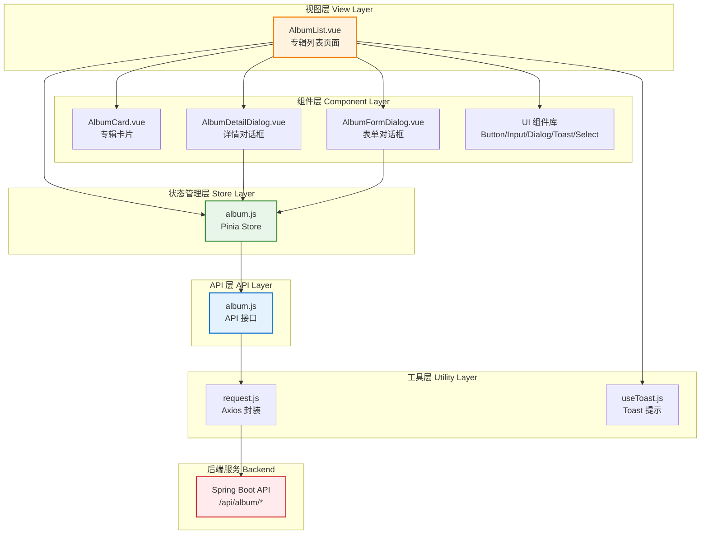

# Design Document - 专辑管理功能 (Album CRUD)

## Overview

本设计文档描述专辑管理功能的技术实现方案。该功能将完全遵循项目现有的 Vue 3 + Pinia + Tailwind CSS 架构模式，复用现有 UI 组件库，参考音乐列表功能的实现结构，确保代码风格和架构的一致性。

### 功能范围
- ✅ 专辑列表浏览（分页、骨架屏加载）
- ✅ 专辑排序功能（发行日期/创建时间升降序）
- ✅ 专辑详情查看（Dialog 对话框）
- ✅ 创建专辑（表单验证、Toast 提示）
- ✅ 编辑专辑（数据预填充、变更检测）
- ✅ 删除专辑（二次确认、关联检查）
- ✅ 响应式设计（移动/平板/桌面端自适应）

### 技术栈
- **框架**: Vue 3.5.24 (Composition API)
- **状态管理**: Pinia 2.3.1
- **路由**: Vue Router 4.6.4
- **样式**: Tailwind CSS 4.1.18
- **HTTP**: Axios 1.13.3
- **UI 组件**: Radix Vue 1.9.17

---

## Steering Document Alignment

### Technical Standards (参考项目技术规范)

本设计完全遵循项目已建立的技术标准：

1. **Vue 3 Composition API**: 所有组件使用 `<script setup>` 语法
2. **响应式系统**: 使用 `ref()` 和 `computed()` 管理状态
3. **代码格式**: 遵循 Prettier 配置（单引号、Tab 缩进、无分号）
4. **组件命名**: PascalCase（大驼峰）
5. **函数命名**: camelCase（小驼峰）
6. **中文注释**: 所有关键函数和复杂逻辑使用中文注释

### Project Structure (项目组织规范)

遵循项目现有目录结构：

```
src/
├── views/              # 页面组件
│   └── AlbumList.vue   # 专辑列表页面（新增）
├── components/         # 业务组件
│   ├── AlbumCard.vue           # 专辑卡片组件（新增）
│   ├── AlbumDetailDialog.vue   # 专辑详情对话框（新增）
│   └── AlbumFormDialog.vue     # 专辑表单对话框（新增）
├── stores/             # Pinia 状态管理
│   └── album.js        # 专辑状态管理（新增）
├── api/                # API 接口层
│   └── album.js        # 专辑 API 接口（新增）
└── router/             # 路由配置
    └── index.js        # 添加 /albums 路由
```

---

## Code Reuse Analysis

### Existing Components to Leverage

以下现有组件将被直接复用，无需重新开发：

| 组件/工具 | 复用方式 | 文件路径 |
|----------|---------|---------|
| **Header** | 直接复用作为页面头部导航 | `src/components/layout/Header.vue` |
| **Button** | 复用于操作按钮（创建、编辑、删除、搜索等） | `src/components/ui/button/Button.vue` |
| **Card** | 复用于专辑卡片布局 | `src/components/ui/card/Card.vue` |
| **Input** | 复用于表单输入（专辑名称、封面 URL、简介） | `src/components/ui/input/Input.vue` |
| **Dialog** | 复用于详情对话框和表单对话框 | `src/components/ui/dialog/` |
| **Pagination** | 复用于列表分页 | `src/components/ui/pagination/Pagination.vue` |
| **Skeleton** | 复用于骨架屏加载占位符 | `src/components/ui/skeleton/Skeleton.vue` |
| **Toast** | 复用于成功/错误提示 | `src/components/ui/toast/` |
| **Select** | 复用于排序下拉框（**新需求**） | `src/components/ui/select/` |
| **request.js** | 复用 Axios 封装工具 | `src/utils/request.js` |
| **useToast.js** | 复用 Toast 提示 Composable | `src/composables/useToast.js` |

### Existing Patterns to Follow

参考现有功能的实现模式：

| 功能模式 | 参考来源 | 复用要点 |
|---------|---------|---------|
| **列表页面布局** | `MusicList.vue` | Grid 布局、骨架屏、分页器、空状态提示 |
| **卡片组件设计** | `MusicCard.vue` | 封面图、标题、副标题、悬停效果 |
| **详情对话框** | `MusicDetailDialog.vue` | Dialog 结构、数据加载、关闭逻辑 |
| **Store 状态管理** | `stores/music.js` | 状态定义、计算属性、操作方法 |
| **API 封装** | `api/music.js` | request 工具使用、JSDoc 注释 |
| **路由配置** | `router/index.js` | 路由路径命名、懒加载导入 |

### Integration Points

与现有系统的集成点：

1. **后端 API 集成**
   - **Base URL**: `http://localhost:8910/api/album`
   - **响应格式**: 统一 `Result<T>` 封装 `{ code, message, data }`
   - **分页格式**: MyBatis-Plus `IPage<T>` 格式 `{ records, total, pages, current, size }`

2. **路由集成**
   - 在 `router/index.js` 中新增路由 `/albums`
   - 集成到 Header 导航菜单

3. **状态管理集成**
   - 创建独立的 `album` Store（与 `music`, `favorite`, `player` 并列）
   - 不与其他 Store 产生依赖关系

4. **UI 组件集成**
   - 使用项目统一的 UI 组件库（Radix Vue + Tailwind CSS）
   - 遵循现有组件的样式和交互模式

---

## Architecture

### 整体架构图



### 数据流设计

```
用户操作 → AlbumList.vue → Store (album.js) → API (album.js) → request.js → Backend API
                ↓                ↓                                           ↓
        更新组件状态      更新 Store 状态                              返回数据
                ↓                ↓                                           ↓
        显示 Toast      触发响应式更新                              解析响应
```

### Modular Design Principles

遵循以下模块化设计原则：

1. **单一职责原则 (Single Responsibility)**
   - `AlbumList.vue` - 仅负责页面布局和路由，不包含业务逻辑
   - `AlbumCard.vue` - 仅负责专辑卡片的展示，不包含列表逻辑
   - `AlbumDetailDialog.vue` - 仅负责详情展示，不包含编辑逻辑
   - `AlbumFormDialog.vue` - 仅负责表单编辑，不包含详情展示
   - `stores/album.js` - 仅负责状态管理，不包含 UI 逻辑
   - `api/album.js` - 仅负责 API 调用，不包含业务逻辑

2. **组件隔离 (Component Isolation)**
   - 每个组件通过 props 和 events 通信
   - 避免组件间直接依赖
   - 使用 Pinia Store 作为全局状态中心

3. **服务层分离 (Service Layer Separation)**
   - API 层 (api/album.js) - 负责与后端通信
   - 状态层 (stores/album.js) - 负责业务逻辑和状态管理
   - 视图层 (views/AlbumList.vue) - 负责用户交互和 UI 渲染

4. **工具模块化 (Utility Modularity)**
   - 日期格式化、URL 校验等工具函数抽取到 `utils/`
   - 表单校验逻辑抽取为独立函数
   - 可复用的业务逻辑抽取为 Composables

---

## Components and Interfaces

### 1. AlbumList.vue (专辑列表页面)

**文件路径**: `src/views/AlbumList.vue`

**Purpose**: 专辑列表页面，负责整体布局、路由管理、组件组合

**Responsibilities**:
- 渲染页面布局（Header、排序框、卡片网格、分页器）
- 管理页面级状态（当前页码、排序方式）
- 处理用户交互（排序切换、分页切换、卡片点击）
- 打开详情对话框和表单对话框

**Template 结构**:
```vue
<template>
  <div class="min-h-screen bg-background">
    <!-- 顶部导航 -->
    <Header />

    <main class="container mx-auto px-4 py-8">
      <!-- 操作栏 (排序 + 创建按钮) -->
      <div class="mb-8 flex items-center justify-between">
        <!-- 排序下拉框 -->
        <Select v-model="sortOption" :options="sortOptions" />
        <!-- 创建专辑按钮 -->
        <Button @click="openCreateDialog">创建专辑</Button>
      </div>

      <!-- 加载状态 - 骨架屏 -->
      <Skeleton v-if="loading" />

      <!-- 专辑列表 -->
      <div v-else>
        <!-- 空状态 -->
        <EmptyState v-if="albumList.length === 0" />
        <!-- 专辑网格 -->
        <div v-else class="grid grid-cols-1 gap-4 sm:grid-cols-2 lg:grid-cols-3">
          <AlbumCard
            v-for="album in albumList"
            :key="album.id"
            :album="album"
            @click="openDetailDialog(album.id)"
          />
        </div>
        <!-- 分页器 -->
        <Pagination
          v-model:current-page="currentPage"
          :total="total"
          @page-change="handlePageChange"
        />
      </div>
    </main>

    <!-- 详情对话框 -->
    <AlbumDetailDialog
      v-model:open="showDetailDialog"
      :album-id="selectedAlbumId"
      @edit="openEditDialog"
      @delete="handleDelete"
    />

    <!-- 表单对话框 (创建/编辑) -->
    <AlbumFormDialog
      v-model:open="showFormDialog"
      :mode="formMode"
      :album-id="selectedAlbumId"
      @success="handleFormSuccess"
    />
  </div>
</template>
```

**Script Setup**:
```javascript
import { ref, computed, onMounted } from 'vue'
import { useAlbumStore } from '@/stores/album'
import { useToast } from '@/composables/useToast'

// 状态管理
const albumStore = useAlbumStore()
const { showToast } = useToast()

// 页面状态
const showDetailDialog = ref(false)
const showFormDialog = ref(false)
const formMode = ref('create') // 'create' | 'edit'
const selectedAlbumId = ref(null)

// 排序选项
const sortOptions = [
  { label: '发行日期降序', value: 'release_date-desc' },
  { label: '发行日期升序', value: 'release_date-asc' },
  { label: '创建时间降序', value: 'create_time-desc' },
  { label: '创建时间升序', value: 'create_time-asc' },
]
const sortOption = ref('release_date-desc')

// 计算属性
const albumList = computed(() => albumStore.albumList)
const total = computed(() => albumStore.total)
const loading = computed(() => albumStore.loading)
const currentPage = computed({
  get: () => albumStore.currentPage,
  set: (val) => albumStore.setPagination(val)
})

// 方法
function handleSortChange() {
  const [field, order] = sortOption.value.split('-')
  albumStore.setSortField(field, order)
  albumStore.fetchAlbumList()
}

function handlePageChange(page) {
  albumStore.setPagination(page)
  albumStore.fetchAlbumList()
  window.scrollTo({ top: 0, behavior: 'smooth' })
}

function openDetailDialog(id) {
  selectedAlbumId.value = id
  showDetailDialog.value = true
}

function openCreateDialog() {
  formMode.value = 'create'
  selectedAlbumId.value = null
  showFormDialog.value = true
}

function openEditDialog(id) {
  formMode.value = 'edit'
  selectedAlbumId.value = id
  showDetailDialog.value = false
  showFormDialog.value = true
}

async function handleDelete(id) {
  const success = await albumStore.deleteAlbum(id)
  if (success) {
    showToast({ type: 'success', message: '专辑删除成功' })
    showDetailDialog.value = false
    albumStore.fetchAlbumList()
  }
}

function handleFormSuccess() {
  showFormDialog.value = false
  albumStore.fetchAlbumList()
}

onMounted(() => {
  albumStore.fetchAlbumList()
})
```

**Dependencies**:
- `useAlbumStore` (Pinia Store)
- `useToast` (Composable)
- UI 组件: Header, Button, Select, AlbumCard, AlbumDetailDialog, AlbumFormDialog, Pagination, Skeleton

**Reuses**:
- 参考 `MusicList.vue` 的页面布局结构
- 复用 Header、Button、Pagination、Skeleton 组件

---

### 2. AlbumCard.vue (专辑卡片组件)

**文件路径**: `src/components/AlbumCard.vue`

**Purpose**: 展示单个专辑的卡片，包含封面图、标题、发行日期等信息

**Props**:
```typescript
interface Props {
  album: {
    id: number
    name: string
    coverUrl: string | null
    releaseDate: string | null
    createTime: string
  }
}
```

**Events**:
```typescript
const emit = defineEmits<{
  click: [albumId: number]
}>()
```

**Template 结构**:
```vue
<template>
  <Card class="cursor-pointer transition-all hover:scale-105 hover:shadow-lg" @click="handleClick">
    <!-- 封面图 -->
    <div class="aspect-square w-full overflow-hidden rounded-t-lg">
      
    </div>

    <!-- 专辑信息 -->
    <CardContent class="p-4">
      <h3 class="truncate text-base font-semibold" :title="album.name">
        {{ album.name }}
      </h3>
      <p class="mt-1 text-sm text-muted-foreground">
        {{ formatReleaseDate(album.releaseDate) }}
      </p>
      <p class="mt-0.5 text-xs text-muted-foreground">
        创建于 {{ formatDateTime(album.createTime) }}
      </p>
    </CardContent>
  </Card>
</template>
```

**Script Setup**:
```javascript
import { ref } from 'vue'
import Card from '@/components/ui/card/Card.vue'
import CardContent from '@/components/ui/card/CardContent.vue'

const props = defineProps({
  album: {
    type: Object,
    required: true
  }
})

const emit = defineEmits(['click'])

const defaultCoverUrl = '/images/default-album-cover.png'

function handleClick() {
  emit('click', props.album.id)
}

function handleImageError(e) {
  e.target.src = defaultCoverUrl
}

function formatReleaseDate(date) {
  if (!date) return '未知发行日期'
  return new Date(date).toLocaleDateString('zh-CN')
}

function formatDateTime(datetime) {
  if (!datetime) return ''
  return new Date(datetime).toLocaleDateString('zh-CN')
}
```

**Dependencies**:
- UI 组件: Card, CardContent

**Reuses**:
- 参考 `MusicCard.vue` 的卡片结构
- 复用 Card 组件

---

### 3. AlbumDetailDialog.vue (专辑详情对话框)

**文件路径**: `src/components/AlbumDetailDialog.vue`

**Purpose**: 展示专辑的详细信息，提供编辑和删除操作入口

**Props**:
```typescript
interface Props {
  open: boolean
  albumId: number | null
}
```

**Events**:
```typescript
const emit = defineEmits<{
  'update:open': [value: boolean]
  edit: [albumId: number]
  delete: [albumId: number]
}>()
```

**Template 结构**:
```vue
<template>
  <Dialog :open="open" @update:open="emit('update:open', $event)">
    <DialogContent class="max-w-2xl">
      <!-- 加载状态 -->
      <Skeleton v-if="loading" />

      <!-- 详情内容 -->
      <div v-else-if="album">
        <DialogHeader>
          <DialogTitle>{{ album.name }}</DialogTitle>
        </DialogHeader>

        <div class="mt-4 space-y-4">
          <!-- 封面图 -->
          <div class="aspect-video w-full overflow-hidden rounded-lg">
            
          </div>

          <!-- 专辑信息 -->
          <div class="space-y-2">
            <InfoRow label="专辑简介" :value="album.description || '暂无简介'" />
            <InfoRow label="发行日期" :value="formatDate(album.releaseDate)" />
            <InfoRow label="歌曲数量" :value="`${album.musicCount || 0} 首歌曲`" />
            <InfoRow label="创建时间" :value="formatDateTime(album.createTime)" />
            <InfoRow label="更新时间" :value="formatDateTime(album.updateTime)" />
          </div>
        </div>

        <!-- 操作按钮 -->
        <DialogFooter class="mt-6">
          <Button variant="outline" @click="handleEdit">编辑</Button>
          <Button variant="destructive" @click="handleDelete">删除</Button>
        </DialogFooter>
      </div>

      <!-- 错误状态 -->
      <div v-else class="py-8 text-center text-muted-foreground">
        加载失败，请重试
      </div>
    </DialogContent>
  </Dialog>
</template>
```

**Script Setup**:
```javascript
import { ref, watch } from 'vue'
import { useAlbumStore } from '@/stores/album'
import Dialog from '@/components/ui/dialog/Dialog.vue'
import DialogContent from '@/components/ui/dialog/DialogContent.vue'
import DialogHeader from '@/components/ui/dialog/DialogHeader.vue'
import DialogTitle from '@/components/ui/dialog/DialogTitle.vue'
import DialogFooter from '@/components/ui/dialog/DialogFooter.vue'
import Button from '@/components/ui/button/Button.vue'
import Skeleton from '@/components/ui/skeleton/Skeleton.vue'

const props = defineProps({
  open: Boolean,
  albumId: Number
})

const emit = defineEmits(['update:open', 'edit', 'delete'])

const albumStore = useAlbumStore()
const album = ref(null)
const loading = ref(false)
const defaultCoverUrl = '/images/default-album-cover.png'

// 监听对话框打开，加载专辑详情
watch(() => props.open, async (isOpen) => {
  if (isOpen && props.albumId) {
    loading.value = true
    album.value = await albumStore.fetchAlbumDetail(props.albumId)
    loading.value = false
  }
})

function handleEdit() {
  emit('edit', props.albumId)
}

async function handleDelete() {
  const confirmed = await confirm('确定要删除专辑 ' + album.value?.name + ' 吗？如果专辑下有歌曲，将无法删除')
  if (confirmed) {
    emit('delete', props.albumId)
  }
}

function formatDate(date) {
  if (!date) return '未知'
  return new Date(date).toLocaleDateString('zh-CN')
}

function formatDateTime(datetime) {
  if (!datetime) return '未知'
  return new Date(datetime).toLocaleString('zh-CN')
}
```

**Dependencies**:
- `useAlbumStore` (Pinia Store)
- UI 组件: Dialog, DialogContent, DialogHeader, DialogTitle, DialogFooter, Button, Skeleton

**Reuses**:
- 参考 `MusicDetailDialog.vue` 的对话框结构
- 复用 Dialog 组件族

---

### 4. AlbumFormDialog.vue (专辑表单对话框)

**文件路径**: `src/components/AlbumFormDialog.vue`

**Purpose**: 提供创建和编辑专辑的表单，包含字段验证和提交逻辑

**Props**:
```typescript
interface Props {
  open: boolean
  mode: 'create' | 'edit'
  albumId: number | null
}
```

**Events**:
```typescript
const emit = defineEmits<{
  'update:open': [value: boolean]
  success: []
}>()
```

**Template 结构**:
```vue
<template>
  <Dialog :open="open" @update:open="emit('update:open', $event)">
    <DialogContent class="max-w-md">
      <DialogHeader>
        <DialogTitle>{{ mode === 'create' ? '创建专辑' : '编辑专辑' }}</DialogTitle>
      </DialogHeader>

      <form @submit.prevent="handleSubmit" class="mt-4 space-y-4">
        <!-- 专辑名称 -->
        <FormField>
          <Label>专辑名称 <span class="text-destructive">*</span></Label>
          <Input
            v-model="formData.name"
            placeholder="请输入专辑名称"
            :maxlength="200"
            @blur="validateField('name')"
          />
          <ErrorMessage v-if="errors.name">{{ errors.name }}</ErrorMessage>
        </FormField>

        <!-- 封面 URL -->
        <FormField>
          <Label>封面 URL</Label>
          <Input
            v-model="formData.coverUrl"
            placeholder="https://example.com/cover.jpg"
            :maxlength="500"
            @blur="validateField('coverUrl')"
          />
          <ErrorMessage v-if="errors.coverUrl">{{ errors.coverUrl }}</ErrorMessage>
        </FormField>

        <!-- 专辑简介 -->
        <FormField>
          <Label>专辑简介</Label>
          <Textarea
            v-model="formData.description"
            placeholder="请输入专辑简介"
            :maxlength="1000"
            rows="4"
          />
        </FormField>

        <!-- 发行日期 -->
        <FormField>
          <Label>发行日期</Label>
          <Input
            v-model="formData.releaseDate"
            type="date"
            @blur="validateField('releaseDate')"
          />
          <ErrorMessage v-if="errors.releaseDate">{{ errors.releaseDate }}</ErrorMessage>
        </FormField>

        <!-- 操作按钮 -->
        <DialogFooter>
          <Button type="button" variant="outline" @click="handleCancel">取消</Button>
          <Button type="submit" :disabled="submitting">
            {{ submitting ? (mode === 'create' ? '创建中...' : '保存中...') : (mode === 'create' ? '创建' : '保存') }}
          </Button>
        </DialogFooter>
      </form>
    </DialogContent>
  </Dialog>
</template>
```

**Script Setup**:
```javascript
import { ref, reactive, watch } from 'vue'
import { useAlbumStore } from '@/stores/album'
import { useToast } from '@/composables/useToast'
import Dialog from '@/components/ui/dialog/Dialog.vue'
import Input from '@/components/ui/input/Input.vue'
import Textarea from '@/components/ui/textarea/Textarea.vue'
import Button from '@/components/ui/button/Button.vue'

const props = defineProps({
  open: Boolean,
  mode: String,
  albumId: Number
})

const emit = defineEmits(['update:open', 'success'])

const albumStore = useAlbumStore()
const { showToast } = useToast()

const formData = reactive({
  name: '',
  coverUrl: '',
  description: '',
  releaseDate: ''
})

const errors = reactive({
  name: '',
  coverUrl: '',
  releaseDate: ''
})

const submitting = ref(false)
const originalData = ref(null)

// 监听对话框打开，加载数据（编辑模式）
watch(() => props.open, async (isOpen) => {
  if (isOpen) {
    if (props.mode === 'edit' && props.albumId) {
      const album = await albumStore.fetchAlbumDetail(props.albumId)
      if (album) {
        formData.name = album.name
        formData.coverUrl = album.coverUrl || ''
        formData.description = album.description || ''
        formData.releaseDate = album.releaseDate || ''
        originalData.value = { ...formData }
      }
    } else {
      resetForm()
    }
  }
})

function validateField(field) {
  errors[field] = ''

  if (field === 'name') {
    if (!formData.name.trim()) {
      errors.name = '专辑名称不能为空'
      return false
    }
    if (formData.name.length > 200) {
      errors.name = '专辑名称长度不能超过200个字符'
      return false
    }
  }

  if (field === 'coverUrl' && formData.coverUrl) {
    const urlPattern = /^https?:\/\/.+/
    if (!urlPattern.test(formData.coverUrl)) {
      errors.coverUrl = '请输入有效的 URL 格式'
      return false
    }
  }

  if (field === 'releaseDate' && formData.releaseDate) {
    const date = new Date(formData.releaseDate)
    if (isNaN(date.getTime())) {
      errors.releaseDate = '请输入有效的日期'
      return false
    }
  }

  return true
}

function validateForm() {
  let valid = true
  valid = validateField('name') && valid
  valid = validateField('coverUrl') && valid
  valid = validateField('releaseDate') && valid
  return valid
}

async function handleSubmit() {
  if (!validateForm()) {
    return
  }

  // 检测是否有变更（编辑模式）
  if (props.mode === 'edit' && originalData.value) {
    const hasChanges = Object.keys(formData).some(
      key => formData[key] !== originalData.value[key]
    )
    if (!hasChanges) {
      showToast({ type: 'warning', message: '未检测到数据变更' })
      return
    }
  }

  submitting.value = true

  try {
    if (props.mode === 'create') {
      const id = await albumStore.createAlbum(formData)
      if (id) {
        showToast({ type: 'success', message: '专辑创建成功' })
        emit('success')
        emit('update:open', false)
      }
    } else {
      const success = await albumStore.updateAlbum(props.albumId, formData)
      if (success) {
        showToast({ type: 'success', message: '专辑更新成功' })
        emit('success')
        emit('update:open', false)
      }
    }
  } catch (error) {
    console.error('表单提交失败:', error)
  } finally {
    submitting.value = false
  }
}

async function handleCancel() {
  const hasChanges = Object.keys(formData).some(
    key => formData[key] !== (originalData.value?.[key] || '')
  )

  if (hasChanges) {
    const confirmed = await confirm('确定要放弃吗？未保存的数据将丢失')
    if (!confirmed) return
  }

  emit('update:open', false)
}

function resetForm() {
  formData.name = ''
  formData.coverUrl = ''
  formData.description = ''
  formData.releaseDate = ''
  Object.keys(errors).forEach(key => errors[key] = '')
  originalData.value = null
}
```

**Dependencies**:
- `useAlbumStore` (Pinia Store)
- `useToast` (Composable)
- UI 组件: Dialog, Input, Textarea, Button

**Reuses**:
- 复用 Dialog、Input、Button 组件
- 复用 useToast Composable

---

### 5. stores/album.js (专辑状态管理)

**文件路径**: `src/stores/album.js`

**Purpose**: 管理专辑相关的全局状态和业务逻辑

**State**:
```javascript
const albumList = ref([])  // 专辑列表
const total = ref(0)        // 总记录数
const loading = ref(false)  // 加载状态

// 查询参数
const searchParams = ref({
  pageNum: 1,
  pageSize: 12,
  sortField: 'release_date',
  sortOrder: 'desc'
})
```

**Computed**:
```javascript
const totalPages = computed(() => Math.ceil(total.value / searchParams.value.pageSize) || 1)
const currentPage = computed(() => searchParams.value.pageNum)
const pageSize = computed(() => searchParams.value.pageSize)
```

**Actions**:
```javascript
/**
 * 获取专辑列表
 */
async function fetchAlbumList()

/**
 * 获取专辑详情
 * @param {number} id - 专辑ID
 * @returns {Promise<Object>} 专辑详情对象
 */
async function fetchAlbumDetail(id)

/**
 * 创建专辑
 * @param {Object} data - 专辑创建数据
 * @returns {Promise<number>} 新增专辑的ID
 */
async function createAlbum(data)

/**
 * 更新专辑
 * @param {number} id - 专辑ID
 * @param {Object} data - 专辑更新数据
 * @returns {Promise<boolean>} 是否更新成功
 */
async function updateAlbum(id, data)

/**
 * 删除专辑
 * @param {number} id - 专辑ID
 * @returns {Promise<boolean>} 是否删除成功
 */
async function deleteAlbum(id)

/**
 * 设置排序字段
 * @param {string} field - 排序字段 (release_date | create_time)
 * @param {string} order - 排序方式 (asc | desc)
 */
function setSortField(field, order)

/**
 * 设置分页
 * @param {number} pageNum - 页码
 * @param {number} pageSize - 每页大小
 */
function setPagination(pageNum, pageSize)

/**
 * 重置搜索条件
 */
function resetSearch()
```

**Implementation**:
```javascript
import { defineStore } from 'pinia'
import { ref, computed } from 'vue'
import { getAlbumList, getAlbumDetail, createAlbum as createAlbumApi, updateAlbum as updateAlbumApi, deleteAlbum as deleteAlbumApi } from '@/api/album'

export const useAlbumStore = defineStore('album', () => {
  // ========== 状态 ==========
  const albumList = ref([])
  const total = ref(0)
  const loading = ref(false)

  const searchParams = ref({
    pageNum: 1,
    pageSize: 12,
    sortField: 'release_date',
    sortOrder: 'desc'
  })

  // ========== 计算属性 ==========
  const totalPages = computed(() => Math.ceil(total.value / searchParams.value.pageSize) || 1)
  const currentPage = computed(() => searchParams.value.pageNum)
  const pageSize = computed(() => searchParams.value.pageSize)

  // ========== 操作方法 ==========

  async function fetchAlbumList() {
    loading.value = true
    try {
      const response = await getAlbumList(searchParams.value)
      albumList.value = response.records || []
      total.value = response.total || 0
    } catch (error) {
      console.error('获取专辑列表失败:', error)
      albumList.value = []
      total.value = 0
    } finally {
      loading.value = false
    }
  }

  async function fetchAlbumDetail(id) {
    try {
      return await getAlbumDetail(id)
    } catch (error) {
      console.error('获取专辑详情失败:', error)
      return null
    }
  }

  async function createAlbum(data) {
    try {
      const id = await createAlbumApi(data)
      return id
    } catch (error) {
      console.error('创建专辑失败:', error)
      throw error
    }
  }

  async function updateAlbum(id, data) {
    try {
      const success = await updateAlbumApi(id, data)
      return success
    } catch (error) {
      console.error('更新专辑失败:', error)
      throw error
    }
  }

  async function deleteAlbum(id) {
    try {
      const success = await deleteAlbumApi(id)
      return success
    } catch (error) {
      console.error('删除专辑失败:', error)
      throw error
    }
  }

  function setSortField(field, order) {
    searchParams.value.sortField = field
    searchParams.value.sortOrder = order
    searchParams.value.pageNum = 1 // 重置到第一页
  }

  function setPagination(pageNum, pageSize) {
    if (pageNum !== undefined) {
      searchParams.value.pageNum = pageNum
    }
    if (pageSize !== undefined) {
      searchParams.value.pageSize = pageSize
    }
  }

  function resetSearch() {
    searchParams.value = {
      pageNum: 1,
      pageSize: 12,
      sortField: 'release_date',
      sortOrder: 'desc'
    }
  }

  return {
    // 状态
    albumList,
    total,
    loading,
    searchParams,
    // 计算属性
    totalPages,
    currentPage,
    pageSize,
    // 方法
    fetchAlbumList,
    fetchAlbumDetail,
    createAlbum,
    updateAlbum,
    deleteAlbum,
    setSortField,
    setPagination,
    resetSearch
  }
})
```

**Dependencies**:
- `pinia` (defineStore)
- `vue` (ref, computed)
- `api/album` (API 方法)

**Reuses**:
- 参考 `stores/music.js` 的 Store 结构
- 复用相同的状态管理模式

---

### 6. api/album.js (专辑 API 接口层)

**文件路径**: `src/api/album.js`

**Purpose**: 封装专辑相关的后端 API 调用

**Interfaces**:
```javascript
/**
 * 分页查询专辑列表
 * @param {Object} params - 查询参数
 * @param {number} params.pageNum - 页码，默认 1
 * @param {number} params.pageSize - 每页大小，默认 12
 * @param {string} params.sortField - 排序字段 (release_date | create_time)
 * @param {string} params.sortOrder - 排序方式 (asc | desc)
 * @returns {Promise<Object>} 分页数据 { records, total, pages, current, size }
 */
export function getAlbumList(params)

/**
 * 获取专辑详情
 * @param {number} id - 专辑ID
 * @returns {Promise<Object>} 专辑详情对象
 */
export function getAlbumDetail(id)

/**
 * 创建专辑
 * @param {Object} data - 专辑创建数据
 * @param {string} data.name - 专辑名称（必填）
 * @param {string} data.coverUrl - 封面URL（可选）
 * @param {string} data.description - 专辑简介（可选）
 * @param {string} data.releaseDate - 发行日期（可选，格式 YYYY-MM-DD）
 * @returns {Promise<number>} 新增专辑的ID
 */
export function createAlbum(data)

/**
 * 更新专辑
 * @param {number} id - 专辑ID
 * @param {Object} data - 专辑更新数据
 * @param {string} data.name - 专辑名称（必填）
 * @param {string} data.coverUrl - 封面URL（可选）
 * @param {string} data.description - 专辑简介（可选）
 * @param {string} data.releaseDate - 发行日期（可选，格式 YYYY-MM-DD）
 * @returns {Promise<boolean>} 是否更新成功
 */
export function updateAlbum(id, data)

/**
 * 删除专辑
 * @param {number} id - 专辑ID
 * @returns {Promise<boolean>} 是否删除成功
 */
export function deleteAlbum(id)
```

**Implementation**:
```javascript
import request from '@/utils/request'

/**
 * 专辑管理相关接口
 */

/**
 * 分页查询专辑列表
 */
export function getAlbumList(params) {
  return request({
    url: '/album/list',
    method: 'get',
    params
  })
}

/**
 * 获取专辑详情
 */
export function getAlbumDetail(id) {
  return request({
    url: `/album/${id}`,
    method: 'get'
  })
}

/**
 * 创建专辑
 */
export function createAlbum(data) {
  return request({
    url: '/album',
    method: 'post',
    data
  })
}

/**
 * 更新专辑
 */
export function updateAlbum(id, data) {
  return request({
    url: `/album/${id}`,
    method: 'put',
    data
  })
}

/**
 * 删除专辑
 */
export function deleteAlbum(id) {
  return request({
    url: `/album/${id}`,
    method: 'delete'
  })
}
```

**Dependencies**:
- `utils/request` (Axios 封装)

**Reuses**:
- 参考 `api/music.js` 的接口封装模式
- 复用 request 工具

---

## Data Models

### AlbumListVO (专辑列表视图对象)

用于列表展示的专辑数据模型。

```typescript
interface AlbumListVO {
  id: number               // 专辑ID
  name: string             // 专辑名称
  coverUrl: string | null  // 封面URL
  releaseDate: string | null  // 发行日期 (YYYY-MM-DD)
  createTime: string       // 创建时间 (YYYY-MM-DD HH:mm:ss)
  updateTime: string       // 更新时间 (YYYY-MM-DD HH:mm:ss)
}
```

**数据来源**: 后端 API `GET /api/album/list` 响应的 `records` 数组

**使用位置**:
- `AlbumList.vue` - 渲染专辑卡片列表
- `AlbumCard.vue` - 展示单个专辑卡片

---

### AlbumDetailVO (专辑详情视图对象)

用于详情展示的专辑数据模型。

```typescript
interface AlbumDetailVO {
  id: number               // 专辑ID
  name: string             // 专辑名称
  coverUrl: string | null  // 封面URL
  description: string | null  // 专辑简介
  releaseDate: string | null  // 发行日期 (YYYY-MM-DD)
  createTime: string       // 创建时间 (YYYY-MM-DD HH:mm:ss)
  updateTime: string       // 更新时间 (YYYY-MM-DD HH:mm:ss)
  musicCount: number       // 歌曲数量
}
```

**数据来源**: 后端 API `GET /api/album/{id}` 响应

**使用位置**:
- `AlbumDetailDialog.vue` - 展示专辑详情
- `AlbumFormDialog.vue` - 编辑模式下预填充表单数据

---

### AlbumCreateDTO (专辑创建请求对象)

用于创建专辑的请求数据模型。

```typescript
interface AlbumCreateDTO {
  name: string             // 专辑名称（必填，最大长度 200）
  coverUrl?: string        // 封面URL（可选，最大长度 500，URL格式）
  description?: string     // 专辑简介（可选，最大长度 1000）
  releaseDate?: string     // 发行日期（可选，格式 YYYY-MM-DD）
}
```

**数据发送**: 前端 `POST /api/album` 请求体

**前端校验规则**:
- `name`: 必填，长度 1-200 字符
- `coverUrl`: 可选，URL 格式校验
- `description`: 可选，最大长度 1000 字符
- `releaseDate`: 可选，日期格式校验

**使用位置**:
- `AlbumFormDialog.vue` - 创建模式下提交表单数据

---

### AlbumUpdateDTO (专辑更新请求对象)

用于更新专辑的请求数据模型。

```typescript
interface AlbumUpdateDTO {
  name: string             // 专辑名称（必填，最大长度 200）
  coverUrl?: string        // 封面URL（可选，最大长度 500，URL格式）
  description?: string     // 专辑简介（可选，最大长度 1000）
  releaseDate?: string     // 发行日期（可选，格式 YYYY-MM-DD）
}
```

**数据发送**: 前端 `PUT /api/album/{id}` 请求体

**前端校验规则**: 与 `AlbumCreateDTO` 相同

**使用位置**:
- `AlbumFormDialog.vue` - 编辑模式下提交表单数据

---

### AlbumQueryDTO (专辑查询参数对象)

用于列表查询的请求参数模型。

```typescript
interface AlbumQueryDTO {
  pageNum: number          // 页码，默认 1
  pageSize: number         // 每页大小，默认 12
  sortField: string        // 排序字段 (release_date | create_time)
  sortOrder: string        // 排序方式 (asc | desc)
}
```

**数据发送**: 前端 `GET /api/album/list` 查询参数

**默认值**:
```javascript
{
  pageNum: 1,
  pageSize: 12,
  sortField: 'release_date',
  sortOrder: 'desc'
}
```

**使用位置**:
- `stores/album.js` - 存储查询参数状态
- `AlbumList.vue` - 修改查询参数（排序、分页）

---

## Error Handling

### Error Scenarios

#### 1. API 请求失败

**场景**: 后端 API 返回错误响应或网络请求失败

**Handling**:
```javascript
try {
  const response = await getAlbumList(params)
  // 处理成功响应
} catch (error) {
  console.error('获取专辑列表失败:', error)

  // 根据错误类型显示不同提示
  if (error.response) {
    // HTTP 错误响应
    const { status, data } = error.response
    switch (status) {
      case 401:
        showToast({ type: 'error', message: '登录已过期，请重新登录' })
        router.push('/login')
        break
      case 403:
        showToast({ type: 'error', message: '您没有权限执行此操作' })
        break
      case 404:
        showToast({ type: 'error', message: '专辑不存在或已被删除' })
        break
      case 500:
        showToast({ type: 'error', message: '服务器错误，请稍后重试' })
        break
      default:
        showToast({ type: 'error', message: data.message || '操作失败' })
    }
  } else if (error.request) {
    // 网络错误
    showToast({ type: 'error', message: '网络连接失败，请检查您的网络设置' })
  } else {
    // 其他错误
    showToast({ type: 'error', message: '操作失败，请稍后重试' })
  }
}
```

**User Impact**: 显示具体的错误提示 Toast，引导用户采取行动（如重新登录、检查网络等）

---

#### 2. 表单验证失败

**场景**: 用户提交的表单数据不符合校验规则

**Handling**:
```javascript
function validateField(field) {
  errors[field] = ''

  if (field === 'name') {
    if (!formData.name.trim()) {
      errors.name = '专辑名称不能为空'
      return false
    }
    if (formData.name.length > 200) {
      errors.name = '专辑名称长度不能超过200个字符'
      return false
    }
  }

  if (field === 'coverUrl' && formData.coverUrl) {
    const urlPattern = /^https?:\/\/.+/
    if (!urlPattern.test(formData.coverUrl)) {
      errors.coverUrl = '请输入有效的 URL 格式'
      return false
    }
  }

  return true
}

function validateForm() {
  let valid = true
  valid = validateField('name') && valid
  valid = validateField('coverUrl') && valid
  valid = validateField('releaseDate') && valid
  return valid
}

async function handleSubmit() {
  if (!validateForm()) {
    // 阻止提交，显示错误提示
    return
  }
  // 继续提交
}
```

**User Impact**: 在对应字段下方显示红色错误提示文本，阻止表单提交，直到用户修正错误

---

#### 3. 封面图片加载失败

**场景**: 专辑封面 URL 无效或网络加载失败

**Handling**:
```javascript
function handleImageError(e) {
  e.target.src = defaultCoverUrl
}
```

```vue

```

**User Impact**: 自动显示默认占位图，不影响其他内容的渲染和交互

---

#### 4. 删除专辑失败（关联歌曲检查）

**场景**: 用户尝试删除的专辑下存在关联歌曲，后端返回业务错误

**Handling**:
```javascript
async function handleDelete(id) {
  const confirmed = await confirm('确定要删除专辑吗？如果专辑下有歌曲，将无法删除')
  if (!confirmed) return

  try {
    const success = await albumStore.deleteAlbum(id)
    if (success) {
      showToast({ type: 'success', message: '专辑删除成功' })
      showDetailDialog.value = false
      albumStore.fetchAlbumList()
    }
  } catch (error) {
    // 后端返回业务错误（如关联歌曲检查失败）
    const errorMessage = error.response?.data?.message || '删除失败'
    showToast({ type: 'error', message: errorMessage })
    // 保持对话框打开，允许用户重试或取消
  }
}
```

**User Impact**: 显示后端返回的具体错误信息（如 "删除失败：专辑下有 5 首歌曲，请先移除歌曲"），对话框保持打开，用户可以重试或取消操作

---

#### 5. 列表数据为空

**场景**: 专辑列表查询无结果（如数据库为空或排序筛选后无匹配项）

**Handling**:
```vue
<div v-if="albumList.length === 0" class="py-20 text-center">
  <svg class="mx-auto h-24 w-24 text-muted-foreground">...</svg>
  <h3 class="mt-4 text-lg font-semibold">暂无专辑数据</h3>
  <p class="mt-2 text-sm text-muted-foreground">点击"创建专辑"按钮添加第一个专辑吧</p>
  <Button class="mt-4" @click="openCreateDialog">创建专辑</Button>
</div>
```

**User Impact**: 显示友好的空状态提示，提供 "创建专辑" 快捷入口，引导用户添加数据

---

#### 6. 请求超时

**场景**: API 请求超过 10 秒未响应

**Handling**:
```javascript
// 在 utils/request.js 中配置 Axios 超时
const instance = axios.create({
  timeout: 10000, // 10秒超时
  // ...
})

instance.interceptors.response.use(
  response => response,
  error => {
    if (error.code === 'ECONNABORTED') {
      showToast({ type: 'error', message: '请求超时，请检查网络连接' })
    }
    return Promise.reject(error)
  }
)
```

**User Impact**: 显示 "请求超时，请检查网络连接" 提示，允许用户重试操作

---

## Testing Strategy

### Unit Testing

**测试框架**: Vitest + Vue Test Utils

**测试覆盖目标**: ≥ 80% 代码覆盖率

**测试重点**:

1. **Store 测试** (`stores/album.js`)
   - ✅ 测试 `fetchAlbumList()` 正常获取列表数据
   - ✅ 测试 `fetchAlbumList()` 处理 API 错误
   - ✅ 测试 `createAlbum()` 成功创建专辑
   - ✅ 测试 `updateAlbum()` 成功更新专辑
   - ✅ 测试 `deleteAlbum()` 成功删除专辑
   - ✅ 测试 `setSortField()` 正确更新排序参数
   - ✅ 测试 `setPagination()` 正确更新分页参数
   - ✅ 测试计算属性 `totalPages`, `currentPage`, `pageSize`

2. **API 测试** (`api/album.js`)
   - ✅ 测试 `getAlbumList()` 调用正确的 URL 和参数
   - ✅ 测试 `getAlbumDetail()` 调用正确的 URL
   - ✅ 测试 `createAlbum()` 发送正确的请求体
   - ✅ 测试 `updateAlbum()` 发送正确的请求体
   - ✅ 测试 `deleteAlbum()` 调用正确的 DELETE 方法

3. **组件测试** (`components/AlbumCard.vue`, `AlbumFormDialog.vue`)
   - ✅ 测试 `AlbumCard.vue` 正确渲染专辑数据
   - ✅ 测试 `AlbumCard.vue` 点击事件触发
   - ✅ 测试 `AlbumCard.vue` 图片加载失败显示默认图
   - ✅ 测试 `AlbumFormDialog.vue` 表单验证规则
   - ✅ 测试 `AlbumFormDialog.vue` 提交成功/失败处理
   - ✅ 测试 `AlbumFormDialog.vue` 取消确认逻辑

**测试示例**:
```javascript
// stores/album.test.js
import { setActivePinia, createPinia } from 'pinia'
import { useAlbumStore } from '@/stores/album'
import { getAlbumList } from '@/api/album'
import { vi } from 'vitest'

vi.mock('@/api/album')

describe('useAlbumStore', () => {
  beforeEach(() => {
    setActivePinia(createPinia())
  })

  it('fetches album list successfully', async () => {
    const mockData = {
      records: [{ id: 1, name: 'Test Album' }],
      total: 1
    }
    getAlbumList.mockResolvedValue(mockData)

    const store = useAlbumStore()
    await store.fetchAlbumList()

    expect(store.albumList).toEqual(mockData.records)
    expect(store.total).toBe(1)
    expect(store.loading).toBe(false)
  })

  it('handles API error gracefully', async () => {
    getAlbumList.mockRejectedValue(new Error('API Error'))

    const store = useAlbumStore()
    await store.fetchAlbumList()

    expect(store.albumList).toEqual([])
    expect(store.total).toBe(0)
    expect(store.loading).toBe(false)
  })
})
```

---

### Integration Testing

**测试框架**: Vitest + Vue Test Utils

**测试重点**:

1. **列表页面集成测试**
   - ✅ 测试页面加载时自动获取专辑列表
   - ✅ 测试排序切换触发列表刷新
   - ✅ 测试分页切换触发列表刷新
   - ✅ 测试点击专辑卡片打开详情对话框
   - ✅ 测试点击 "创建专辑" 按钮打开表单对话框

2. **详情对话框集成测试**
   - ✅ 测试打开对话框时自动加载专辑详情
   - ✅ 测试点击 "编辑" 按钮切换到编辑模式
   - ✅ 测试点击 "删除" 按钮弹出确认对话框
   - ✅ 测试确认删除后刷新列表

3. **表单对话框集成测试**
   - ✅ 测试创建模式下表单为空
   - ✅ 测试编辑模式下表单预填充数据
   - ✅ 测试表单提交成功后关闭对话框并刷新列表
   - ✅ 测试表单提交失败后显示错误提示

---

### End-to-End Testing

**测试框架**: Playwright

**测试环境**: 前端 + 后端完整环境

**测试场景**:

1. **用户浏览专辑列表**
   - ✅ 访问 `/albums` 路径
   - ✅ 验证专辑卡片正确渲染
   - ✅ 验证分页器显示正确
   - ✅ 点击下一页，验证列表更新

2. **用户排序专辑列表**
   - ✅ 点击排序下拉框
   - ✅ 选择 "发行日期升序"
   - ✅ 验证列表重新排序
   - ✅ 验证页码重置为第 1 页

3. **用户查看专辑详情**
   - ✅ 点击专辑卡片
   - ✅ 验证详情对话框打开
   - ✅ 验证专辑信息正确展示
   - ✅ 点击关闭按钮，验证对话框关闭

4. **用户创建专辑**
   - ✅ 点击 "创建专辑" 按钮
   - ✅ 验证表单对话框打开
   - ✅ 填写表单字段（名称、封面 URL、简介、发行日期）
   - ✅ 点击 "创建" 按钮
   - ✅ 验证成功提示 Toast 显示
   - ✅ 验证对话框关闭
   - ✅ 验证列表刷新，新专辑出现在列表中

5. **用户编辑专辑**
   - ✅ 打开专辑详情对话框
   - ✅ 点击 "编辑" 按钮
   - ✅ 验证表单预填充当前专辑数据
   - ✅ 修改专辑名称
   - ✅ 点击 "保存" 按钮
   - ✅ 验证成功提示 Toast 显示
   - ✅ 验证对话框关闭
   - ✅ 验证列表刷新，专辑名称已更新

6. **用户删除专辑**
   - ✅ 打开专辑详情对话框
   - ✅ 点击 "删除" 按钮
   - ✅ 验证确认对话框弹出
   - ✅ 点击 "确认删除"
   - ✅ 验证成功提示 Toast 显示
   - ✅ 验证详情对话框关闭
   - ✅ 验证列表刷新，专辑已从列表中移除

7. **用户删除失败（关联歌曲检查）**
   - ✅ 打开有歌曲关联的专辑详情
   - ✅ 点击 "删除" 按钮
   - ✅ 点击 "确认删除"
   - ✅ 验证错误提示 Toast 显示（包含具体原因）
   - ✅ 验证详情对话框保持打开

8. **响应式设计测试**
   - ✅ 切换到移动端视口（< 640px）
   - ✅ 验证专辑卡片为 1 列布局
   - ✅ 验证排序下拉框占满全宽
   - ✅ 切换到平板视口（640px ~ 1024px）
   - ✅ 验证专辑卡片为 2 列布局
   - ✅ 切换到桌面视口（≥ 1024px）
   - ✅ 验证专辑卡片为 3 列布局

**测试示例**:
```javascript
// e2e/album-crud.spec.js
import { test, expect } from '@playwright/test'

test.describe('专辑管理功能', () => {
  test.beforeEach(async ({ page }) => {
    await page.goto('http://localhost:5173/albums')
  })

  test('用户创建专辑', async ({ page }) => {
    // 点击创建专辑按钮
    await page.click('button:has-text("创建专辑")')

    // 验证表单对话框打开
    await expect(page.locator('role=dialog')).toBeVisible()

    // 填写表单
    await page.fill('input[placeholder="请输入专辑名称"]', '测试专辑')
    await page.fill('input[placeholder="https://example.com/cover.jpg"]', 'https://example.com/test.jpg')
    await page.fill('textarea[placeholder="请输入专辑简介"]', '这是一个测试专辑')
    await page.fill('input[type="date"]', '2026-02-01')

    // 点击创建按钮
    await page.click('button:has-text("创建")')

    // 验证成功提示
    await expect(page.locator('text=专辑创建成功')).toBeVisible()

    // 验证对话框关闭
    await expect(page.locator('role=dialog')).not.toBeVisible()

    // 验证列表中出现新专辑
    await expect(page.locator('text=测试专辑')).toBeVisible()
  })
})
```

---

## Performance Optimization

### 优化策略

1. **懒加载和代码分割**
   - 使用 Vue Router 的懒加载功能，按需加载页面组件
   - 使用动态 import 分割大型组件代码

2. **图片优化**
   - 使用 `loading="lazy"` 属性延迟加载封面图
   - 使用 `@error` 事件处理图片加载失败
   - 使用默认占位图减少空白闪烁

3. **列表渲染优化**
   - 使用 `key` 属性优化 `v-for` 渲染
   - 如果列表长度 > 100，考虑使用虚拟滚动（如 `vue-virtual-scroller`）
   - 使用 `keep-alive` 缓存列表页面状态

4. **状态管理优化**
   - 避免不必要的响应式数据（使用 `Object.freeze()` 冻结静态数据）
   - 使用 `computed` 缓存计算结果
   - 避免在 Store 中存储过大的数据

5. **网络请求优化**
   - 使用 Axios 请求取消功能，避免重复请求
   - 使用防抖技术减少频繁请求
   - 使用骨架屏优化感知性能

---

## Deployment Considerations

### 环境配置

1. **开发环境**
   - Vite Dev Server: `http://localhost:5173`
   - 后端 API: `http://localhost:8910`
   - 代理配置: `/api` → `http://localhost:8910/api`

2. **生产环境**
   - 前端静态资源部署到 CDN 或 Nginx
   - 后端 API 部署到生产服务器
   - 配置 CORS 跨域策略

### 构建优化

1. **Vite 构建配置**
   ```javascript
   // vite.config.js
   export default defineConfig({
     build: {
       rollupOptions: {
         output: {
           manualChunks: {
             'vendor': ['vue', 'vue-router', 'pinia'],
             'ui': ['radix-vue']
           }
         }
       }
     }
   })
   ```

2. **资源压缩**
   - 启用 Gzip/Brotli 压缩
   - 压缩图片资源
   - 移除未使用的 CSS（使用 PurgeCSS）

---

**文档版本**: v1.0
**创建时间**: 2026-02-01
**创建者**: AI Assistant
**审核状态**: 待审核
