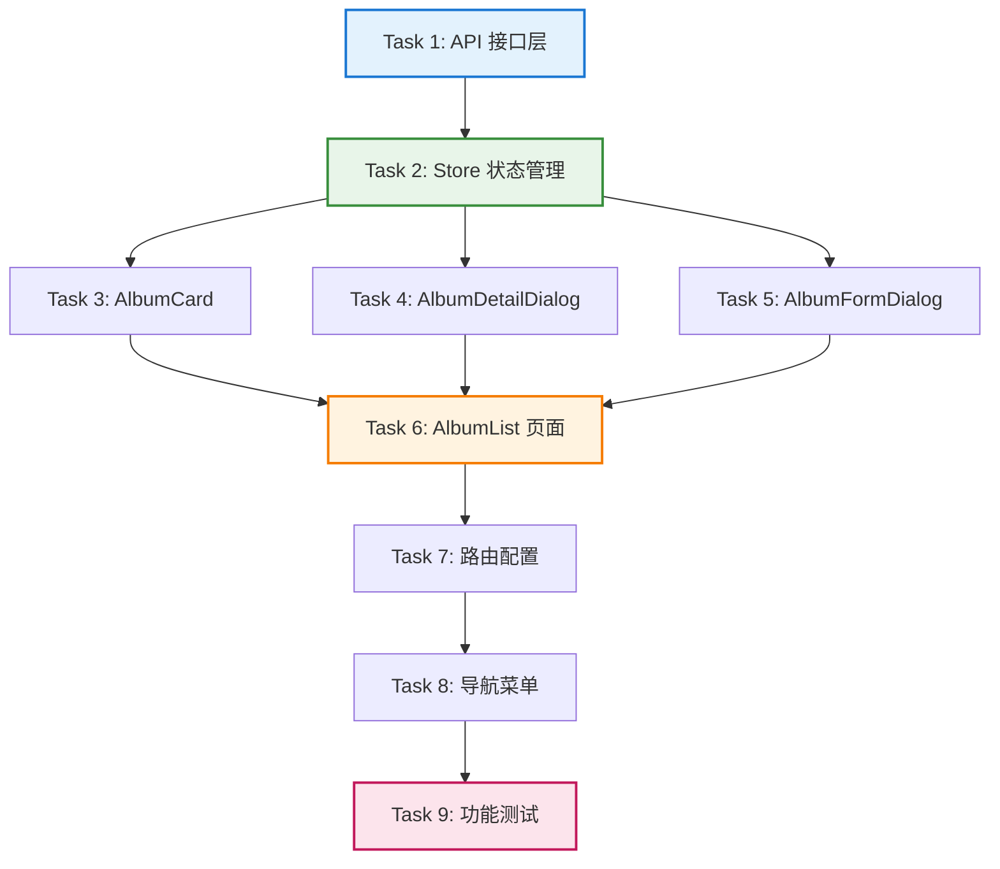

# Tasks Document - 专辑管理功能 (Album CRUD)

**Spec Name**: album-crud
**Total Tasks**: 9
**Estimated Total Time**: ~6-8 hours

---

## Task Overview

本任务列表将设计文档转换为可执行的实现任务。任务按照依赖关系组织，建议按顺序执行。

### Task Status Legend
- `[ ]` - Pending (待执行)
- `[-]` - In Progress (进行中)
- `[x]` - Completed (已完成)

---

## 阶段 1: API 层和状态管理基础

### Task 1: 创建专辑 API 接口层

- [x] 1. 创建 api/album.js 文件，实现后端 API 调用封装
  - **Files**: `src/api/album.js` (新建)
  - **Estimated Time**: 30 分钟
  - **Purpose**: 封装专辑相关的后端 API 调用，提供统一的接口方法
  - **_Leverage**:
    - `src/utils/request.js` - Axios 封装工具
    - `src/api/music.js` - 参考音乐 API 实现模式
  - **_Requirements**: Requirements 1, 2, 3, 4, 5, 6
  - **_Prompt**:
    ```
    Implement the task for spec album-crud, first run spec-workflow-guide to get the workflow guide then implement the task:

    Role: 前端 API 开发工程师，精通 Axios 和 RESTful API 设计

    Task: 创建 src/api/album.js 文件，实现专辑相关的后端 API 调用封装。需要实现以下 5 个接口方法：
    1. getAlbumList(params) - 分页查询专辑列表 (GET /album/list)
    2. getAlbumDetail(id) - 获取专辑详情 (GET /album/{id})
    3. createAlbum(data) - 创建专辑 (POST /album)
    4. updateAlbum(id, data) - 更新专辑 (PUT /album/{id})
    5. deleteAlbum(id) - 删除专辑 (DELETE /album/{id})

    每个方法需要：
    - 使用 request 工具统一调用
    - 添加完整的 JSDoc 注释（中文）
    - 参数和返回值类型说明清晰
    - 遵循 src/api/music.js 的实现模式

    Restrictions:
    - 不要修改 src/utils/request.js 文件
    - 不要创建新的 Axios 实例
    - 不要硬编码 API Base URL (使用 request 工具的配置)
    - 不要添加不必要的第三方依赖

    _Leverage:
    - 使用 src/utils/request.js 的 request 工具
    - 参考 src/api/music.js 的接口封装模式
    - 参考后端 API 文档：D:\JavaCodeStudy\wangyiyun-music\.zcf\plan\history\20260201-专辑功能CRUD.md

    _Requirements:
    - Requirement 1: 专辑列表浏览（getAlbumList）
    - Requirement 2: 专辑排序功能（getAlbumList 参数）
    - Requirement 3: 查看专辑详情（getAlbumDetail）
    - Requirement 4: 创建专辑（createAlbum）
    - Requirement 5: 编辑专辑（updateAlbum）
    - Requirement 6: 删除专辑（deleteAlbum）

    Success:
    - src/api/album.js 文件创建成功
    - 所有 5 个接口方法实现完整
    - JSDoc 注释清晰完整
    - 代码遵循项目 Prettier 格式（单引号、Tab 缩进、无分号）
    - 接口调用格式与 src/api/music.js 一致

    Instructions:
    1. 在开始实施任务前，编辑 tasks.md，将当前任务状态从 [ ] 改为 [-]
    2. 完成任务后，使用 log-implementation 工具记录实施详情（包含 artifacts.apiEndpoints）
    3. 记录完成后，编辑 tasks.md，将当前任务状态从 [-] 改为 [x]
    ```

---

### Task 2: 创建专辑状态管理 Store

- [x] 2. 创建 stores/album.js 文件，实现 Pinia 状态管理
  - **Files**: `src/stores/album.js` (新建)
  - **Estimated Time**: 45 分钟
  - **Dependencies**: Task 1
  - **Purpose**: 管理专辑相关的全局状态和业务逻辑
  - **_Leverage**:
    - `src/stores/music.js` - 参考音乐 Store 实现模式
    - `src/api/album.js` - 调用 API 接口
  - **_Requirements**: Requirements 1, 2, 3, 4, 5, 6
  - **_Prompt**:
    ```
    Implement the task for spec album-crud, first run spec-workflow-guide to get the workflow guide then implement the task:

    Role: 前端状态管理工程师，精通 Pinia 和 Vue 3 Composition API

    Task: 创建 src/stores/album.js 文件，实现专辑状态管理。需要实现以下内容：

    State（状态）:
    - albumList (专辑列表)
    - total (总记录数)
    - loading (加载状态)
    - searchParams (查询参数：pageNum, pageSize, sortField, sortOrder)

    Computed（计算属性）:
    - totalPages (总页数)
    - currentPage (当前页码)
    - pageSize (每页大小)

    Actions（操作方法）:
    - fetchAlbumList() - 获取专辑列表
    - fetchAlbumDetail(id) - 获取专辑详情
    - createAlbum(data) - 创建专辑
    - updateAlbum(id, data) - 更新专辑
    - deleteAlbum(id) - 删除专辑
    - setSortField(field, order) - 设置排序字段
    - setPagination(pageNum, pageSize) - 设置分页
    - resetSearch() - 重置搜索条件

    Restrictions:
    - 不要直接操作 DOM
    - 不要在 Store 中使用 Vue Router
    - 不要在 Store 中显示 Toast 提示（由组件处理）
    - 错误处理使用 try-catch，记录日志到 console
    - 不要修改 src/stores/music.js 或其他 Store

    _Leverage:
    - 使用 src/api/album.js 的接口方法
    - 参考 src/stores/music.js 的 Store 结构
    - 使用 Pinia defineStore 定义 Store
    - 使用 Vue 3 ref、computed 管理状态

    _Requirements:
    - Requirement 1: 专辑列表浏览（fetchAlbumList, searchParams）
    - Requirement 2: 专辑排序功能（setSortField）
    - Requirement 3: 查看专辑详情（fetchAlbumDetail）
    - Requirement 4: 创建专辑（createAlbum）
    - Requirement 5: 编辑专辑（updateAlbum）
    - Requirement 6: 删除专辑（deleteAlbum）

    Success:
    - src/stores/album.js 文件创建成功
    - 所有状态、计算属性、操作方法实现完整
    - 使用 Pinia defineStore 正确定义 Store
    - 错误处理完善（try-catch + console.error）
    - 代码遵循项目 Prettier 格式
    - 参考 src/stores/music.js 的实现模式

    Instructions:
    1. 在开始实施任务前，编辑 tasks.md，将当前任务状态从 [ ] 改为 [-]
    2. 完成任务后，使用 log-implementation 工具记录实施详情（包含 artifacts.classes 或 artifacts.functions）
    3. 记录完成后，编辑 tasks.md，将当前任务状态从 [-] 改为 [x]
    ```

---

## 阶段 2: UI 组件开发

### Task 3: 创建专辑卡片组件

- [x] 3. 创建 AlbumCard.vue 组件，展示单个专辑卡片
  - **Files**: `src/components/AlbumCard.vue` (新建)
  - **Estimated Time**: 30 分钟
  - **Purpose**: 展示单个专辑的卡片，包含封面图、标题、发行日期等信息
  - **_Leverage**:
    - `src/components/MusicCard.vue` - 参考音乐卡片实现模式
    - `src/components/ui/card/` - 使用 Card UI 组件
  - **_Requirements**: Requirement 1
  - **_Prompt**:
    ```
    Implement the task for spec album-crud, first run spec-workflow-guide to get the workflow guide then implement the task:

    Role: Vue 3 前端组件开发工程师，精通 Composition API 和 Tailwind CSS

    Task: 创建 src/components/AlbumCard.vue 组件，展示单个专辑的卡片信息。组件需要：

    Props:
    - album (Object, required) - 专辑对象，包含 id, name, coverUrl, releaseDate, createTime

    Events:
    - click - 点击卡片时触发，传递 albumId

    Template 结构:
    - 使用 Card 组件作为容器
    - 封面图（aspect-square，使用 img 标签，支持懒加载，错误处理）
    - 专辑名称（h3，truncate 截断）
    - 发行日期（格式化为 YYYY-MM-DD）
    - 创建时间（格式化为 YYYY-MM-DD HH:mm）
    - 悬停效果（scale-105, shadow-lg）

    Restrictions:
    - 不要在组件内调用 API（数据由父组件传入）
    - 不要在组件内使用 Pinia Store
    - 不要添加编辑、删除等操作按钮（仅展示）
    - 日期格式化使用原生 JavaScript（不引入第三方库）
    - 图片加载失败时显示默认占位图 /images/default-album-cover.png

    _Leverage:
    - 参考 src/components/MusicCard.vue 的卡片结构
    - 使用 src/components/ui/card/Card.vue 和 CardContent.vue
    - 使用 Tailwind CSS 样式类

    _Requirements:
    - Requirement 1: 专辑列表浏览（展示专辑卡片）

    Success:
    - AlbumCard.vue 组件创建成功
    - 组件正确接收 album prop 并展示信息
    - 点击卡片触发 click 事件
    - 封面图支持懒加载和错误处理
    - 日期格式化正确
    - 悬停效果流畅
    - 代码遵循 Vue 3 Composition API 和 Tailwind CSS 规范

    Instructions:
    1. 在开始实施任务前，编辑 tasks.md，将当前任务状态从 [ ] 改为 [-]
    2. 完成任务后，使用 log-implementation 工具记录实施详情（包含 artifacts.components）
    3. 记录完成后，编辑 tasks.md，将当前任务状态从 [-] 改为 [x]
    ```

---

### Task 4: 创建专辑详情对话框组件

- [x] 4. 创建 AlbumDetailDialog.vue 组件，展示专辑详情
  - **Files**: `src/components/AlbumDetailDialog.vue` (新建)
  - **Estimated Time**: 45 分钟
  - **Dependencies**: Task 2
  - **Purpose**: 展示专辑的详细信息，提供编辑和删除操作入口
  - **_Leverage**:
    - `src/components/MusicDetailDialog.vue` - 参考音乐详情对话框
    - `src/components/ui/dialog/` - 使用 Dialog UI 组件
    - `src/stores/album.js` - 调用 Store 获取详情
  - **_Requirements**: Requirement 3, 6
  - **_Prompt**:
    ```
    Implement the task for spec album-crud, first run spec-workflow-guide to get the workflow guide then implement the task:

    Role: Vue 3 前端组件开发工程师，精通对话框组件和异步数据加载

    Task: 创建 src/components/AlbumDetailDialog.vue 组件，展示专辑详情并提供操作入口。组件需要：

    Props:
    - open (Boolean, required) - 对话框打开状态
    - albumId (Number) - 专辑ID

    Events:
    - update:open - 更新对话框打开状态
    - edit - 点击编辑按钮时触发，传递 albumId
    - delete - 点击删除按钮时触发，传递 albumId

    功能要求:
    - 监听 open 变化，打开时自动加载专辑详情（调用 albumStore.fetchAlbumDetail）
    - 加载中显示骨架屏 (Skeleton 组件)
    - 加载成功显示完整信息：封面、名称、简介、发行日期、创建时间、更新时间、歌曲数量
    - 加载失败显示错误提示和重试按钮
    - 底部操作按钮："编辑"、"删除"
    - 删除时弹出确认对话框（使用 window.confirm）
    - 支持 Esc 键和点击外部关闭对话框

    Restrictions:
    - 不要在组件内实现删除逻辑（由父组件处理）
    - 不要显示 Toast 提示（由父组件处理）
    - 使用 window.confirm 进行删除确认（不引入额外对话框组件）
    - 日期格式化使用原生 JavaScript

    _Leverage:
    - 参考 src/components/MusicDetailDialog.vue 的对话框结构
    - 使用 src/components/ui/dialog/ 下的 Dialog 组件族
    - 使用 src/components/ui/skeleton/Skeleton.vue
    - 使用 src/stores/album.js 的 useAlbumStore

    _Requirements:
    - Requirement 3: 查看专辑详情（加载和展示详情）
    - Requirement 6: 删除专辑（提供删除入口和确认）

    Success:
    - AlbumDetailDialog.vue 组件创建成功
    - 对话框打开时自动加载专辑详情
    - 加载中、成功、失败三种状态处理完善
    - 编辑和删除按钮正确触发事件
    - 删除确认对话框显示正确
    - 代码遵循 Vue 3 Composition API 规范

    Instructions:
    1. 在开始实施任务前，编辑 tasks.md，将当前任务状态从 [ ] 改为 [-]
    2. 完成任务后，使用 log-implementation 工具记录实施详情（包含 artifacts.components 和 artifacts.integrations）
    3. 记录完成后，编辑 tasks.md，将当前任务状态从 [-] 改为 [x]
    ```

---

### Task 5: 创建专辑表单对话框组件

- [x] 5. 创建 AlbumFormDialog.vue 组件，提供创建和编辑表单
  - **Files**: `src/components/AlbumFormDialog.vue` (新建)
  - **Estimated Time**: 60 分钟
  - **Dependencies**: Task 2
  - **Purpose**: 提供创建和编辑专辑的表单，包含字段验证和提交逻辑
  - **_Leverage**:
    - `src/components/ui/dialog/` - 使用 Dialog UI 组件
    - `src/components/ui/input/Input.vue` - 使用 Input 组件
    - `src/stores/album.js` - 调用 Store 的创建/更新方法
    - `src/composables/useToast.js` - 使用 Toast 提示
  - **_Requirements**: Requirement 4, 5
  - **_Prompt**:
    ```
    Implement the task for spec album-crud, first run spec-workflow-guide to get the workflow guide then implement the task:

    Role: Vue 3 前端表单开发工程师，精通表单验证和状态管理

    Task: 创建 src/components/AlbumFormDialog.vue 组件，提供创建和编辑专辑的表单功能。组件需要：

    Props:
    - open (Boolean, required) - 对话框打开状态
    - mode (String, required) - 表单模式 ('create' | 'edit')
    - albumId (Number) - 专辑ID（编辑模式时传入）

    Events:
    - update:open - 更新对话框打开状态
    - success - 表单提交成功后触发

    表单字段:
    1. 专辑名称 (必填, Input, maxlength=200)
    2. 封面 URL (可选, Input, maxlength=500, URL 格式校验)
    3. 专辑简介 (可选, Textarea, maxlength=1000)
    4. 发行日期 (可选, Input type="date")

    功能要求:
    - 创建模式：表单为空
    - 编辑模式：打开时加载专辑详情并预填充表单
    - 前端校验：专辑名称不为空、URL 格式有效、日期格式有效
    - 校验失败：在字段下显示错误提示，阻止提交
    - 变更检测：编辑模式下，如果未修改任何字段，提示 "未检测到数据变更"
    - 提交中：禁用提交按钮，显示 "创建中..." 或 "保存中..."
    - 提交成功：显示 Toast 成功提示，关闭对话框，触发 success 事件
    - 提交失败：显示 Toast 错误提示，保留表单数据
    - 取消确认：如果有未保存的修改，弹出确认对话框 "确定要放弃吗？未保存的数据将丢失"

    Restrictions:
    - 不要跳过前端校验直接提交
    - 不要在提交失败后清空表单数据
    - URL 校验使用正则表达式 /^https?:\/\/.+/
    - 使用 window.confirm 进行取消确认
    - 不要修改 Store 的接口定义

    _Leverage:
    - 使用 src/components/ui/dialog/ 下的 Dialog 组件族
    - 使用 src/components/ui/input/Input.vue
    - 使用 src/components/ui/textarea/Textarea.vue
    - 使用 src/components/ui/button/Button.vue
    - 使用 src/stores/album.js 的 useAlbumStore
    - 使用 src/composables/useToast.js 的 useToast

    _Requirements:
    - Requirement 4: 创建专辑（表单验证、提交、成功/失败处理）
    - Requirement 5: 编辑专辑（数据预填充、变更检测、更新提交）

    Success:
    - AlbumFormDialog.vue 组件创建成功
    - 创建模式和编辑模式正确切换
    - 表单验证规则正确实施
    - 变更检测和取消确认正常工作
    - 提交成功/失败处理完善
    - Toast 提示正确显示
    - 代码遵循 Vue 3 Composition API 规范

    Instructions:
    1. 在开始实施任务前，编辑 tasks.md，将当前任务状态从 [ ] 改为 [-]
    2. 完成任务后，使用 log-implementation 工具记录实施详情（包含 artifacts.components 和 artifacts.integrations）
    3. 记录完成后，编辑 tasks.md，将当前任务状态从 [-] 改为 [x]
    ```

---

## 阶段 3: 页面和路由

### Task 6: 创建专辑列表页面

- [x] 6. 创建 AlbumList.vue 页面组件，整合所有功能
  - **Files**: `src/views/AlbumList.vue` (新建)
  - **Estimated Time**: 60 分钟
  - **Dependencies**: Task 2, 3, 4, 5
  - **Purpose**: 专辑列表页面，负责整体布局、路由管理、组件组合
  - **_Leverage**:
    - `src/views/MusicList.vue` - 参考音乐列表页面布局
    - `src/components/layout/Header.vue` - 使用 Header 组件
    - `src/components/ui/` - 使用各种 UI 组件
    - `src/stores/album.js` - 使用 Store 管理状态
  - **_Requirements**: Requirements 1, 2, 3, 4, 5, 6, 7, 8, 9
  - **_Prompt**:
    ```
    Implement the task for spec album-crud, first run spec-workflow-guide to get the workflow guide then implement the task:

    Role: Vue 3 前端页面开发工程师，精通页面布局和组件集成

    Task: 创建 src/views/AlbumList.vue 页面组件，整合专辑管理的所有功能。页面需要：

    页面结构:
    1. Header 导航栏（复用现有组件）
    2. 操作栏：排序下拉框（Select）+ 创建专辑按钮（Button）
    3. 列表区域：
       - 加载中：骨架屏（Skeleton，12 个占位卡片）
       - 加载成功：专辑网格（Grid 布局，AlbumCard 组件）
       - 空状态：提示 + 创建按钮
    4. 分页器（Pagination）
    5. 专辑详情对话框（AlbumDetailDialog）
    6. 专辑表单对话框（AlbumFormDialog）

    功能要求:
    - 页面挂载时自动加载专辑列表
    - 排序下拉框：4 个选项（发行日期降序/升序、创建时间降序/升序）
    - 排序变更：重新请求数据，重置页码为第 1 页
    - 分页切换：加载对应页码数据，滚动到页面顶部
    - 点击专辑卡片：打开详情对话框
    - 点击创建专辑：打开表单对话框（创建模式）
    - 详情对话框编辑：关闭详情对话框，打开表单对话框（编辑模式）
    - 详情对话框删除：调用 Store 删除方法，成功后关闭对话框并刷新列表
    - 表单提交成功：关闭表单对话框，刷新列表
    - 响应式布局：移动端（1 列）、平板（2 列）、桌面（3 列）

    Restrictions:
    - 不要在页面内实现业务逻辑（由 Store 处理）
    - 不要直接操作 DOM（使用 Vue 响应式系统）
    - 删除成功后不要手动从列表中移除，而是重新调用 fetchAlbumList
    - 使用 window.scrollTo({ top: 0, behavior: 'smooth' }) 滚动到顶部

    _Leverage:
    - 参考 src/views/MusicList.vue 的页面布局
    - 使用 src/components/layout/Header.vue
    - 使用 src/components/ui/ 下的 Button, Select, Pagination, Skeleton
    - 使用 src/components/AlbumCard.vue
    - 使用 src/components/AlbumDetailDialog.vue
    - 使用 src/components/AlbumFormDialog.vue
    - 使用 src/stores/album.js 的 useAlbumStore
    - 使用 src/composables/useToast.js 的 useToast

    _Requirements:
    - Requirement 1: 专辑列表浏览（列表展示、分页）
    - Requirement 2: 专辑排序功能（排序下拉框）
    - Requirement 3: 查看专辑详情（打开详情对话框）
    - Requirement 4: 创建专辑（打开表单对话框）
    - Requirement 5: 编辑专辑（从详情切换到表单）
    - Requirement 6: 删除专辑（调用删除方法）
    - Requirement 7: 响应式设计（Grid 布局）
    - Requirement 8: 错误处理（Toast 提示）
    - Requirement 9: 性能优化（骨架屏、滚动优化）

    Success:
    - AlbumList.vue 页面创建成功
    - 页面布局清晰，响应式设计正确
    - 所有功能（排序、分页、CRUD）正常工作
    - 对话框状态管理正确（打开/关闭、模式切换）
    - 数据刷新逻辑正确（创建/编辑/删除后刷新列表）
    - 代码遵循 Vue 3 Composition API 规范
    - 参考 src/views/MusicList.vue 的实现模式

    Instructions:
    1. 在开始实施任务前，编辑 tasks.md，将当前任务状态从 [ ] 改为 [-]
    2. 完成任务后，使用 log-implementation 工具记录实施详情（包含 artifacts.components 和 artifacts.integrations）
    3. 记录完成后，编辑 tasks.md，将当前任务状态从 [-] 改为 [x]
    ```

---

### Task 7: 添加专辑列表路由配置

- [x] 7. 在 router/index.js 中添加 /albums 路由
  - **Files**: `src/router/index.js` (修改)
  - **Estimated Time**: 15 分钟
  - **Dependencies**: Task 6
  - **Purpose**: 配置专辑列表页面的路由
  - **_Leverage**:
    - `src/router/index.js` - 现有路由配置
  - **_Requirements**: Requirement 1
  - **_Prompt**:
    ```
    Implement the task for spec album-crud, first run spec-workflow-guide to get the workflow guide then implement the task:

    Role: 前端路由配置工程师，精通 Vue Router

    Task: 在 src/router/index.js 中添加专辑列表页面的路由配置。需要：

    路由配置:
    - path: '/albums'
    - name: 'AlbumList'
    - component: () => import('../views/AlbumList.vue') (懒加载)
    - meta: { title: '专辑列表' }（可选）

    Restrictions:
    - 不要修改现有路由配置
    - 不要删除或注释其他路由
    - 使用懒加载（动态 import）优化性能
    - 路由路径使用小写 + 连字符（/albums）

    _Leverage:
    - 参考 src/router/index.js 中现有路由的配置方式
    - 使用 Vue Router 的懒加载模式

    _Requirements:
    - Requirement 1: 专辑列表浏览（路由访问 /albums）

    Success:
    - /albums 路由添加成功
    - 路由使用懒加载方式导入组件
    - 路由配置格式与现有路由一致
    - 访问 http://localhost:5173/albums 能正常加载页面

    Instructions:
    1. 在开始实施任务前，编辑 tasks.md，将当前任务状态从 [ ] 改为 [-]
    2. 完成任务后，使用 log-implementation 工具记录实施详情（包含 filesModified）
    3. 记录完成后，编辑 tasks.md，将当前任务状态从 [-] 改为 [x]
    ```

---

## 阶段 4: 集成和完善

### Task 8: 更新导航菜单添加专辑入口

- [x] 8. 在 Header.vue 中添加专辑列表导航链接
  - **Files**: `src/components/layout/Header.vue` (修改)
  - **Estimated Time**: 10 分钟
  - **Dependencies**: Task 7
  - **Purpose**: 在导航菜单中添加专辑列表的入口链接
  - **_Leverage**:
    - `src/components/layout/Header.vue` - 现有导航组件
  - **_Requirements**: Requirement 1
  - **_Prompt**:
    ```
    Implement the task for spec album-crud, first run spec-workflow-guide to get the workflow guide then implement the task:

    Role: 前端 UI 开发工程师，精通 Vue Router 和导航组件

    Task: 在 src/components/layout/Header.vue 中添加专辑列表的导航链接。需要：

    导航链接:
    - 文本: "专辑"
    - 路径: /albums
    - 使用 router-link 组件（与现有导航链接一致）
    - 放置位置: 在 "音乐" 和 "收藏" 之间（或根据现有布局调整）

    Restrictions:
    - 不要修改现有导航链接
    - 不要改变导航栏的整体布局和样式
    - 使用与现有链接相同的样式类
    - 不要引入新的依赖或组件

    _Leverage:
    - 参考 src/components/layout/Header.vue 中现有导航链接的实现
    - 使用 Vue Router 的 router-link 组件

    _Requirements:
    - Requirement 1: 专辑列表浏览（导航菜单入口）

    Success:
    - Header.vue 中成功添加专辑导航链接
    - 点击链接能正确跳转到 /albums 路由
    - 导航链接样式与现有链接一致
    - 不影响现有导航功能

    Instructions:
    1. 在开始实施任务前，编辑 tasks.md，将当前任务状态从 [ ] 改为 [-]
    2. 完成任务后，使用 log-implementation 工具记录实施详情（包含 filesModified）
    3. 记录完成后，编辑 tasks.md，将当前任务状态从 [-] 改为 [x]
    ```

---

### Task 9: 功能测试和验证

- [-] 9. 测试所有功能并修复问题
  - **Files**: 所有相关文件
  - **Estimated Time**: 60 分钟
  - **Dependencies**: Task 1-8
  - **Purpose**: 验证所有功能正常工作，修复发现的问题
  - **_Leverage**:
    - 浏览器开发者工具（Console、Network）
    - Vue DevTools
  - **_Requirements**: All Requirements (1-9)
  - **_Prompt**:
    ```
    Implement the task for spec album-crud, first run spec-workflow-guide to get the workflow guide then implement the task:

    Role: 前端 QA 工程师和开发工程师，精通功能测试和问题排查

    Task: 测试专辑管理的所有功能，确保符合需求文档的验收标准。测试内容包括：

    测试清单:
    1. ✅ 访问 /albums 路径，验证页面正常加载
    2. ✅ 验证专辑列表正确展示（骨架屏 → 数据加载）
    3. ✅ 验证分页功能（切换页码、数据更新、滚动到顶部）
    4. ✅ 验证排序功能（切换排序方式、列表重新排序、页码重置）
    5. ✅ 验证点击专辑卡片打开详情对话框
    6. ✅ 验证详情对话框正确展示专辑信息
    7. ✅ 验证点击 "创建专辑" 按钮打开表单对话框（创建模式）
    8. ✅ 验证表单验证规则（必填、URL 格式、最大长度）
    9. ✅ 验证创建专辑成功（Toast 提示、对话框关闭、列表刷新）
    10. ✅ 验证点击 "编辑" 按钮打开表单对话框（编辑模式、数据预填充）
    11. ✅ 验证编辑专辑成功（Toast 提示、对话框关闭、列表刷新）
    12. ✅ 验证未修改字段时点击保存提示 "未检测到数据变更"
    13. ✅ 验证点击 "删除" 按钮弹出确认对话框
    14. ✅ 验证删除专辑成功（Toast 提示、对话框关闭、列表刷新）
    15. ✅ 验证删除失败时显示错误提示（如专辑下有歌曲）
    16. ✅ 验证空状态提示（列表为空时显示）
    17. ✅ 验证响应式设计（移动端 1 列、平板 2 列、桌面 3 列）
    18. ✅ 验证封面图加载失败显示默认占位图
    19. ✅ 验证 API 错误处理（网络错误、401/403/404/500）
    20. ✅ 验证 Console 无报错和警告

    问题修复:
    - 发现问题后，记录到测试报告
    - 修复问题并重新测试
    - 确保所有测试通过后完成任务

    Restrictions:
    - 不要跳过任何测试项
    - 不要忽略 Console 中的警告和错误
    - 不要仅测试"正常流程"，也要测试异常流程
    - 使用真实后端 API 进行测试（确保后端服务运行）

    _Leverage:
    - 使用浏览器开发者工具（Console、Network、Elements）
    - 使用 Vue DevTools 查看组件状态和 Store 数据
    - 参考需求文档的验收标准 (Acceptance Criteria)

    _Requirements:
    - All Requirements (1-9)

    Success:
    - 所有测试项通过
    - 发现的问题已修复并重新验证
    - Console 无报错和警告
    - 功能符合需求文档的验收标准
    - 代码质量符合项目规范

    Instructions:
    1. 在开始实施任务前，编辑 tasks.md，将当前任务状态从 [ ] 改为 [-]
    2. 完成任务后，使用 log-implementation 工具记录实施详情（包含测试结果和修复的问题）
    3. 记录完成后，编辑 tasks.md，将当前任务状态从 [-] 改为 [x]
    ```

---

## Task Dependencies Graph



---

## Implementation Notes

### 开发顺序建议
1. 先实现基础层（API + Store）- Task 1, 2
2. 再实现组件层（卡片 + 对话框）- Task 3, 4, 5
3. 然后实现页面层（页面 + 路由）- Task 6, 7
4. 最后集成完善（导航 + 测试）- Task 8, 9

### 关键注意事项
- 每个任务完成后必须使用 log-implementation 工具记录实施详情
- 任务状态更新：[ ] → [-] → [x]
- 严格遵循 _Leverage 中的参考文件和模式
- 错误处理和用户反馈是每个任务的必要部分
- 代码格式遵循项目 Prettier 配置

### 测试策略
- Task 9 是关键的验证环节，不可跳过
- 建议在每个任务完成后进行基本功能测试
- 使用浏览器开发者工具和 Vue DevTools 辅助开发

---

**文档版本**: v1.0
**创建时间**: 2026-02-01
**创建者**: AI Assistant
**状态**: 待审批
