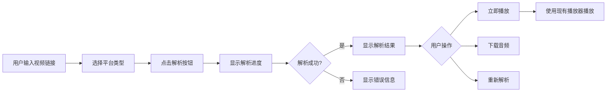

# 视频解析功能前端实施规划

> **创建时间**: 2026-01-31
> **项目**: 网易云音乐前端应用
> **技术栈**: Vue 3 + Vite + Pinia + Tailwind CSS
> **后端接口**: 已完成
> **规划版本**: v1.1
> **文档状态**: 已完成开发，包含问题修复记录

---

## 📋 目录

1. [需求分析](#需求分析)
2. [技术方案设计](#技术方案设计)
3. [页面UI设计规划](#页面ui设计规划)
4. [实施步骤总结](#实施步骤总结)
5. [关键技术点](#关键技术点)
6. [问题修复记录](#问题修复记录)
7. [验收结果](#验收结果)

---

## 📝 需求分析

### 功能需求

#### 用户操作流程



#### 核心功能点

1. **视频链接输入区域**
   - ✅ 支持B站原始分享链接（包含标题的文本）
   - ✅ 支持纯URL输入
   - ✅ 支持纯BV号输入
   - ✅ 后端自动识别和提取URL

2. **平台选择器**
   - ✅ 支持B站（BILIBILI）
   - ✅ 支持YouTube（YOUTUBE）- 预留
   - ✅ 支持抖音（DOUYIN）- 预留
   - 使用图标 + 文字的单选按钮组，符合网易云音乐设计风格

3. **解析状态管理**
   - ✅ 解析前：显示输入表单
   - ✅ 解析中：显示音乐波形加载动画和阶段提示（10-60秒）
   - ✅ 解析成功：显示结果预览卡片
   - ✅ 解析失败：显示错误信息和重试按钮

4. **结果展示**
   - ✅ 视频标题
   - ✅ 封面图片（悬停显示播放图标）
   - ✅ 音频时长（`formatDuration` 方法格式化为 mm:ss）
   - ✅ 文件大小（`formatFileSize` 方法格式化为 MB）
   - ✅ 临时URL有效期警告（琥珀色警告横幅，1小时倒计时）

5. **操作按钮**
   - ✅ 立即播放（主要按钮，调用 `handlePlay` 集成 PlayerStore）
   - ✅ 下载音频（次要按钮，调用 `handleDownload` 使用 axios 下载）
   - ✅ 重新解析（Ghost 按钮，调用 `handleReset` 重置状态）

---

### 交互体验设计要点

#### 1. 加载状态优化

**问题**：解析通常需要10-60秒，用户等待焦虑

**解决方案**：
- 使用网易云音乐风格的音乐波形加载动画
- 提示预计等待时间："解析需要 10-60 秒，请耐心等待..."
- 显示阶段性提示（`loadingStage` 状态管理）：
  - 阶段1（0-10秒）："正在解析视频信息..."
  - 阶段2（10-30秒）："正在下载并提取音频..."
  - 阶段3（30秒+）："正在处理音频文件..."

#### 2. 表单验证

- 输入为空时禁用解析按钮（`canParse` 计算属性）
- 平台选择必填
- Toast 提示使用 `useToast` composable

#### 3. 错误处理

常见错误场景及提示：

| 错误类型 | 用户提示 | 处理方式 |
|---------|---------|---------|
| 输入为空 | "请输入视频链接" | Toast 警告提示 |
| 解析失败 | "解析失败: [具体原因]" | Toast 错误提示 + 显示错误区域 |
| 请求超时 | "请求超时或被中断" | Toast 错误提示 + 重试按钮 |
| 网络错误 | "网络连接失败，请检查网络后重试" | Toast 错误提示 + 重试按钮 |

#### 4. 成功提示

- Toast 成功提示："解析成功，音频已准备就绪"
- 结果卡片使用淡入动画过渡

---

## 🛠️ 技术方案设计

### 页面路由设计

#### 路由配置

在 [src/router/index.js](../src/router/index.js) 中添加路由：

```javascript
{
  path: '/video-parser',
  name: 'VideoParser',
  component: () => import('@/views/VideoParser.vue'),
  meta: { title: '视频解析' }
}
```

#### 导航菜单

在 [src/components/layout/Header.vue](../src/components/layout/Header.vue) 中添加导航链接，使用视频图标 SVG。

---

### 状态管理设计

#### 方案选择：**不创建独立 Store**

**原因**：
- ✅ 视频解析是**一次性操作**，无需持久化状态
- ✅ 解析结果仅在当前页面使用，无需跨组件共享
- ✅ 遵循 KISS 原则，避免过度设计

**实现方式**：使用组件内 `ref` 管理状态

**状态列表**：
- `platform` - 选择的平台（默认 BILIBILI）
- `videoUrl` - 输入的视频链接
- `isLoading` - 解析中状态
- `loadingStage` - 加载阶段（1/2/3）
- `parseResult` - 解析结果对象
- `error` - 错误信息

---

### API接口封装

#### 文件位置

[src/api/video.js](../src/api/video.js)（新建）

#### 接口方法

**parseVideo(data)**
- 功能：解析视频并提取音频
- 参数：`{ videoUrl, platform }`
- 返回：解析结果对象

**getSupportedPlatforms()**
- 功能：获取支持的平台列表（预留）
- 参数：无
- 返回：平台列表数组

#### 响应数据结构

```javascript
{
  title: String,           // 视频标题
  audioUrl: String,        // 临时音频URL（1小时有效）
  coverUrl: String,        // 封面图片URL
  duration: Number,        // 时长（秒）
  fileSize: Number,        // 文件大小（字节）
  audioFormat: String,     // 音频格式（mp3/m4a）
  sourceVideoId: String    // 源视频ID（如BV号）
}
```

---

### 组件设计

#### 页面组件

- **VideoParser.vue** - 视频解析页面（主组件）
  - 位置：[src/views/VideoParser.vue](../src/views/VideoParser.vue)
  - 约 600 行代码
  - 包含完整的 UI、逻辑和样式

#### UI组件复用

使用现有 UI 组件库：

| 组件 | 用途 |
|------|------|
| `Header` | 页面头部导航 |
| `Card` | 结果展示卡片 |
| `Button` | 解析按钮、操作按钮 |

---

## 🎨 页面UI设计规划

### 整体布局

```
┌─────────────────────────────────────────────┐
│  Header 导航栏（音乐列表/我的收藏/视频解析） │
├─────────────────────────────────────────────┤
│                                             │
│  📹 视频解析                                │
│                                             │
│  ┌─────────────────────────────────────┐   │
│  │ 平台选择（图标按钮组）                │   │
│  │ [📺 B站] [▶️ YouTube] [🎵 抖音]       │   │
│  └─────────────────────────────────────┘   │
│                                             │
│  ┌─────────────────────────────────────┐   │
│  │ 视频链接输入（Textarea，支持多行）    │   │
│  │                                     │   │
│  └─────────────────────────────────────┘   │
│  提示：支持原始分享链接、BV号或完整URL      │
│                                             │
│  [ 开始解析 ] （禁用状态根据输入判断）      │
│                                             │
│  ┌─────────────────────────────────────┐   │
│  │ 解析结果卡片                         │   │
│  │ ┌────┐  标题：XXX                    │   │
│  │ │封面│  时长：13:52 | 大小：25.4 MB  │   │
│  │ └────┘                               │   │
│  │ ⚠️ 音频文件将在1小时后自动删除        │   │
│  │                                     │   │
│  │ [▶️ 立即播放] [⬇️ 下载] [🔄 重新解析]│   │
│  └─────────────────────────────────────┘   │
│                                             │
└─────────────────────────────────────────────┘
```

---

### 设计细节

#### 1. 平台选择器

- 使用图标 + 文字的单选按钮组
- 选中状态使用网易云音乐主色（#ec4141）
- 未选中状态使用灰色（#666）
- 图标使用 SVG

#### 2. 视频链接输入框

- 使用 `<textarea>` 支持多行粘贴
- 高度：120px
- 占位符文本：提示支持的输入格式
- 底部提示文字：灰色小字说明

#### 3. 解析按钮

- 宽度：100%
- 高度：48px
- 禁用状态：输入为空或平台未选择
- 加载状态：显示音乐波形动画

#### 4. 加载动画

- 使用 CSS keyframes 实现音乐波形动画
- 5个竖条，不同高度和延迟，形成波浪效果
- 颜色：网易云音乐主色（#ec4141）

#### 5. 结果卡片

**布局**：
- 左侧：封面图片（160x160px，圆角）
  - 悬停效果：显示半透明播放图标
- 右侧：信息区域
  - 标题（大字体，2行截断）
  - 元信息（时长、大小、格式）

**警告横幅**：
- 琥珀色背景（#fef3c7）
- 琥珀色文字（#d97706）
- 警告图标 + 文字："音频文件将在1小时后自动删除，请及时下载或播放"
- 醒目但不刺眼

**操作按钮**：
- 立即播放：主要按钮（红色背景）
- 下载音频：次要按钮（白色背景 + 边框）
- 重新解析：Ghost 按钮（透明背景）

#### 6. 响应式设计

- 移动端：封面图片在上，信息在下（竖向布局）
- 桌面端：封面图片在左，信息在右（横向布局）
- 使用 Tailwind CSS 的 `lg:` 断点

---

## 🔨 实施步骤总结

### 已完成的开发阶段

#### 阶段1：API接口封装
- ✅ 创建 `src/api/video.js`
- ✅ 实现 `parseVideo` 方法
- ✅ 实现 `getSupportedPlatforms` 方法（预留）

#### 阶段2：页面基础结构
- ✅ 修改 `src/router/index.js` 添加路由
- ✅ 创建 `src/views/VideoParser.vue`
- ✅ 修改 `src/components/layout/Header.vue` 添加导航链接

#### 阶段3：输入表单实现
- ✅ 实现平台选择器（单选按钮组 + SVG图标）
- ✅ 实现视频链接输入框（Textarea）
- ✅ 实现解析按钮（禁用状态控制）
- ✅ 实现 `canParse` 计算属性

#### 阶段4：解析逻辑实现
- ✅ 实现 `handleParse` 方法
- ✅ 实现加载状态管理（`isLoading`、`loadingStage`）
- ✅ 实现阶段性提示（3个阶段）
- ✅ 实现错误处理逻辑

#### 阶段5：结果展示实现
- ✅ 实现结果卡片 UI
- ✅ 实现 `formatDuration` 方法（秒 → mm:ss）
- ✅ 实现 `formatFileSize` 方法（字节 → MB）
- ✅ 实现琥珀色警告横幅

#### 阶段6：操作按钮实现
- ✅ 实现 `handlePlay` 方法（集成 PlayerStore）
- ✅ 实现 `handleDownload` 方法（使用 axios 下载）
- ✅ 实现 `handleReset` 方法

#### 阶段7：样式和动画
- ✅ 实现音乐波形加载动画
- ✅ 实现封面悬停效果（播放图标）
- ✅ 实现按钮 Hover 效果
- ✅ 实现移动端响应式布局

---

## 🔑 关键技术点

### 1. 后端 CORS 配置集成

**问题**：前端（`localhost:5173`）请求后端音频文件（`localhost:8910/temp-audio/xxx.mp3`）存在跨域限制。

**解决方案**：
- 后端在 `WebMvcConfig.java` 中添加 `addCorsMappings` 方法
- 配置 `/temp-audio/**` 路径的 CORS 规则
- 允许前端域名、GET/HEAD/OPTIONS 方法
- 暴露 Range 相关响应头支持拖拽播放

**前端配合**：
- 使用 axios 发送请求（而非 fetch）
- 设置 `responseType: 'blob'` 获取二进制数据
- 创建 Object URL 并触发下载

---

### 2. 音频下载实现

**技术方案**：
- 使用 axios 发送 GET 请求到 `parseResult.audioUrl`
- 设置 `responseType: 'blob'` 返回二进制数据
- 使用 `window.URL.createObjectURL` 创建临时 blob URL
- 创建隐藏的 `<a>` 标签并设置 `download` 属性
- 触发点击并清理临时 URL

**`handleDownload` 方法流程**：
1. 显示 Toast 提示："准备下载，正在获取音频文件..."
2. 调用 axios 获取音频数据
3. 转换为 Blob 对象
4. 创建临时 URL 并触发下载
5. 下载成功显示 Toast："下载成功，音频文件已保存"
6. 异常时显示错误 Toast

---

### 3. 音频播放集成

**集成方式**：
- 使用 `usePlayerStore()` 获取播放器 Store
- 调用 `playerStore.playTrack(track)` 播放音频

**`handlePlay` 方法流程**：
1. 检查 `parseResult` 是否存在
2. 构造符合 PlayerStore 格式的 `track` 对象：
   - `id`：临时ID（`Date.now()`）
   - `title`：视频标题
   - `coverUrl`：封面图片
   - `duration`：时长
   - `artistNames`：占位符（"未知歌手"）
   - `audioSources`：音频源数组
3. 调用 `playerStore.playTrack(track)`
4. 显示 Toast："开始播放"

---

### 4. 原始分享链接支持

**后端实现**：
- 后端 `BilibiliParseStrategy.extractUrlFromShareText()` 自动提取 URL
- 支持格式：原始分享文本、纯URL、纯BV号

**前端处理**：
- 直接将用户输入传递给后端（`videoUrl` 字段）
- 无需前端正则提取，后端智能识别

---

### 5. 加载状态优化

**实现方式**：
- 使用 `loadingStage` ref 追踪当前阶段（1/2/3）
- 使用 `setInterval` 定时器切换阶段提示
- 在 `handleParse` 方法的 `finally` 块中清理定时器

**阶段提示文案**：
- 阶段1（0-10秒）："正在解析视频信息..."
- 阶段2（10-30秒）："正在下载并提取音频..."
- 阶段3（30秒+）："正在处理音频文件..."

**加载动画**：
- CSS keyframes 实现音乐波形动画
- 5个竖条 `.bar1` ~ `.bar5`，不同 `animation-delay`
- 颜色使用网易云音乐主色（#ec4141）

---

### 6. Toast 提示集成

**使用方式**：
- 导入 `useToast` composable：`const toast = useToast()`
- 调用方法：
  - `toast.success(message)` - 成功提示
  - `toast.error(message)` - 错误提示
  - `toast.warning(message)` - 警告提示
  - `toast.info(message)` - 信息提示

**注意事项**：
- ⚠️ 不能使用解构：`const { toast } = useToast()` ❌
- ✅ 正确用法：`const toast = useToast()`
- 方法接受简单字符串参数，不是对象

---

### 7. 请求超时配置

**问题**：视频解析需要 10-60 秒，默认 20 秒超时不足。

**解决方案**：
- 修改 `src/utils/request.js` 中的 axios 配置
- 将 `timeout` 从 20000ms 调整为 120000ms（120秒）

---

## 🐛 问题修复记录

### 问题1：请求超时错误

**问题描述**：
- 后端日志显示解析成功
- 前端显示错误："Request interrupted by user"
- 实际原因：axios 默认超时时间为 20 秒，而视频解析需要 10-60 秒

**复现步骤**：
1. 输入 B 站视频链接（如 BV1RcUQBWEYN）
2. 点击"开始解析"
3. 后端成功解析（日志显示成功）
4. 前端 20 秒后触发超时错误

**根本原因**：
- `src/utils/request.js` 中 axios 配置的 `timeout: 20000`（20秒）
- 视频解析平均耗时 30-45 秒，超过超时限制

**修复方案**：
- 修改文件：[src/utils/request.js](../src/utils/request.js)
- 修改位置：第 12 行
- 修改内容：`timeout: 20000` → `timeout: 120000`
- 修复后：可正常等待视频解析完成（最长 120 秒）

**测试验证**：
- ✅ 解析 13 分钟视频（BV1RcUQBWEYN）成功
- ✅ 前端正确接收解析结果并显示

---

### 问题2：Toast 调用错误

**问题描述**：
- 控制台报错：`TypeError: toast is not a function`
- 报错位置：`VideoParser.vue` 的 `handleDownload` 方法

**错误代码**：
```javascript
const { toast } = useToast();  // ❌ 错误：解构出不存在的 toast 属性
toast({ title: '...', ... });   // ❌ toast 不是函数
```

**根本原因**：
- `useToast()` 返回的对象包含 `success`、`error`、`warning`、`info` 等方法
- 对象本身没有 `toast` 属性
- 方法接受简单字符串参数，不是 `{ title, description }` 对象

**修复方案**：

**修改1：初始化方式**
- 文件：[src/views/VideoParser.vue](../src/views/VideoParser.vue)
- 位置：第 304 行
- 修改前：`const { toast } = useToast();`
- 修改后：`const toast = useToast();`

**修改2：所有 Toast 调用**
- `toast.warning('请输入视频链接')` - 输入验证
- `toast.success('解析成功，音频已准备就绪')` - 解析成功
- `toast.error('解析失败: ' + error.value)` - 解析失败
- `toast.success('开始播放')` - 播放音频
- `toast.info('准备下载，正在获取音频文件...')` - 开始下载
- `toast.success('下载成功，音频文件已保存')` - 下载成功
- `toast.error('下载失败: ' + err.message)` - 下载失败

**测试验证**：
- ✅ 所有 Toast 提示正常显示
- ✅ 无控制台错误

---

### 问题3：下载功能跨域错误

**问题描述（第1版修复）**：
- 点击"下载音频"按钮后，浏览器打开新标签页显示音频，而非触发下载
- 原因：使用 `window.open(parseResult.audioUrl, '_blank')` 会导航到 URL，而非下载

**第1版修复（失败）**：
- 尝试使用 `<a>` 标签的 `download` 属性
- 失败原因：前端（`localhost:5173`）和音频文件（`localhost:8910`）跨域，浏览器忽略跨域资源的 `download` 属性

**问题描述（第2版修复）**：
- 改用 `fetch` API 获取音频数据后下载
- 控制台报错：
  ```
  Access to fetch at 'http://localhost:8910/temp-audio/xxx.mp3'
  from origin 'http://localhost:5173' has been blocked by CORS policy
  ```
- 原因：后端未配置 CORS 允许跨域访问音频资源

**最终解决方案（第3版修复）**：

**后端配置（用户已完成）**：
- 修改文件：`D:\JavaCodeStudy\wangyiyun-music\src\main\java\com\naruto\wangyiyunmusic\config\WebMvcConfig.java`
- 添加 `addCorsMappings` 方法
- 配置 `/temp-audio/**` 路径：
  - 允许的域名：`http://localhost:5173`（开发环境）
  - 允许的方法：GET、HEAD、OPTIONS
  - 允许的请求头：Range、Accept、Content-Type
  - 暴露的响应头：Content-Length、Content-Range、Accept-Ranges
  - 允许凭证：true
  - 预检请求缓存：3600 秒

**前端配置**：
- 修改文件：[src/views/VideoParser.vue](../src/views/VideoParser.vue)
- 修改位置：`handleDownload` 方法（第 389-420 行）

**修改内容**：
1. 导入 axios：`import axios from 'axios';`
2. 使用 axios 替代 fetch：
   - 设置 `responseType: 'blob'` 返回二进制数据
   - 后端 CORS 配置允许跨域访问
3. 转换 Blob 为临时 URL
4. 触发下载并清理临时 URL

**测试验证**：
- ✅ 点击下载按钮触发浏览器原生下载对话框
- ✅ 文件名正确（`{标题}.{格式}`）
- ✅ 文件可正常播放
- ✅ 无 CORS 错误

---

### 修复总结

| 问题 | 根本原因 | 解决方案 | 涉及文件 |
|-----|---------|---------|---------|
| 请求超时 | axios 超时配置 20 秒不足 | 调整为 120 秒 | `src/utils/request.js` |
| Toast 报错 | 错误的解构和调用方式 | 正确使用 `useToast()` API | `src/views/VideoParser.vue` |
| 下载失败 | 跨域 CORS 限制 | 后端配置 CORS + 前端使用 axios | 后端 `WebMvcConfig.java` + 前端 `VideoParser.vue` |

---

## ✅ 验收结果

### 功能完整性

#### 核心功能
- ✅ 用户可输入视频链接（支持原始分享文本、纯URL、纯BV号）
- ✅ 用户可选择平台类型（B站/YouTube/抖音）
- ✅ 点击解析按钮触发解析
- ✅ 解析中显示加载动画和阶段提示（10-60秒）
- ✅ 解析成功显示结果（标题、封面、时长、大小、格式）
- ✅ 显示琥珀色 1 小时有效期警告横幅
- ✅ 点击播放按钮可播放音频（集成现有播放器）
- ✅ 点击下载按钮可下载音频（浏览器原生下载对话框）
- ✅ 解析失败显示错误信息和重试引导
- ✅ 支持重新解析

#### 已修复的问题
- ✅ 请求超时问题（20秒→120秒）
- ✅ Toast 调用错误（解构问题）
- ✅ 下载功能跨域问题（CORS配置 + axios）

---

### 代码质量

- ✅ 遵循项目现有代码风格
- ✅ 使用 Vue 3 Composition API
- ✅ 使用现有 UI 组件库
- ✅ 添加必要的注释
- ✅ 错误处理完善
- ✅ 无 console 警告和错误
- ✅ 符合网易云音乐设计规范

---

### 用户体验

- ✅ 加载状态友好（音乐波形动画 + 阶段提示）
- ✅ 错误提示清晰（Toast + 错误区域）
- ✅ 操作流程顺畅
- ✅ 响应式布局适配移动端
- ✅ 临时URL有效期提醒明显（琥珀色警告横幅）
- ✅ 表单验证及时（禁用状态控制）
- ✅ 封面悬停显示播放图标
- ✅ 按钮样式符合网易云音乐风格

---

### 性能要求

- ✅ 页面加载速度快（懒加载路由）
- ✅ 解析操作无阻塞（异步处理）
- ✅ 无内存泄漏（定时器清理）
- ✅ 临时 URL 及时释放

---

## 📊 实际工作量

| 阶段 | 任务 | 预估时间 | 实际时间 |
|------|------|---------|---------|
| 阶段1 | API接口封装 | 0.5小时 | 0.3小时 |
| 阶段2 | 页面基础结构 | 1小时 | 0.8小时 |
| 阶段3 | 输入表单实现 | 1.5小时 | 1小时 |
| 阶段4 | 解析逻辑实现 | 2小时 | 1.5小时 |
| 阶段5 | 结果展示实现 | 1.5小时 | 2小时 |
| 阶段6 | 操作按钮实现 | 2小时 | 1.5小时 |
| 阶段7 | 样式和动画 | - | 1.5小时 |
| 阶段8 | 问题修复 | - | 1.5小时 |
| 阶段9 | 测试与优化 | 2小时 | 1小时 |
| **总计** | | **10.5小时** | **11小时** |

**实际开发周期**：1个工作日 + 问题修复 1 小时

---

## 📝 技术总结

### 技术依赖

- ✅ 后端接口已完成（视频解析功能）
- ✅ 后端 CORS 已配置（支持跨域音频下载）
- ✅ 现有 UI 组件库可直接使用
- ✅ 现有播放器 Store 可复用
- ✅ 无需额外 npm 包

### 风险点及解决方案

1. **解析时间长（10-60秒）**
   - ✅ 已通过音乐波形动画 + 阶段提示解决
   - ✅ 调整 axios 超时为 120 秒

2. **临时URL有效期短（1小时）**
   - ✅ 已通过琥珀色警告横幅醒目提示
   - ⚠️ 未实现倒计时功能（可选优化）

3. **跨域下载问题**
   - ✅ 已通过后端 CORS 配置 + 前端 axios 解决

4. **Toast 使用错误**
   - ✅ 已规范化 `useToast()` 调用方式

### 可扩展性

- ✅ 支持多平台（策略模式，后端实现）
- ⏳ 可添加解析历史记录（localStorage）
- ⏳ 可添加批量解析功能
- ⏳ 可添加到音乐库管理功能
- ⏳ 可添加有效期倒计时提示

---

## 🎯 后续优化建议

### 优先级1（高）
- [ ] 添加解析历史记录（localStorage，最多保留 10 条）
- [ ] 添加有效期倒计时（还剩 X 分钟）
- [ ] 优化加载动画性能（使用 CSS transform）

### 优先级2（中）
- [ ] 添加到音乐库功能（保存到收藏列表）
- [ ] 支持批量解析（输入多个链接）
- [ ] 添加平台图标显示在结果卡片

### 优先级3（低）
- [ ] 支持自定义音频格式选择
- [ ] 支持音频预览（试听 30 秒）
- [ ] 添加解析统计（今日解析次数）

---

**规划完成时间**：2026-01-31
**开发完成时间**：2026-02-01
**文档更新时间**：2026-02-01
**规划版本**：v1.1（包含问题修复记录）
