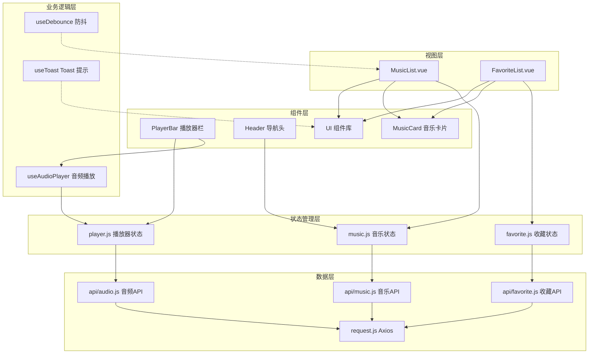

# 网易云音乐前端项目

> **最后更新：** 2026-01-29
> **项目状态：** 开发中
> **技术栈：** Vue 3 + Vite + Pinia + Tailwind CSS

---

## 📋 项目概览

网易云音乐前端应用，基于 Vue 3 生态构建的现代化 SPA 单页应用，提供音乐浏览、收藏管理和在线播放功能。

### 核心特性

- **音乐浏览** - 分页浏览音乐列表，支持关键词搜索
- **收藏管理** - 收藏/取消收藏音乐，查看收藏列表
- **音乐播放** - 完整的播放控制功能，支持多种播放模式
- **响应式设计** - 基于 Tailwind CSS 的现代化 UI
- **组件化开发** - 完善的 UI 组件库和业务组件

---

## 🏗️ 项目架构

### 技术栈

| 技术 | 版本 | 用途 |
|------|------|------|
| Vue | 3.5.24 | 前端框架（使用 Composition API） |
| Vite | 7.2.4 | 构建工具和开发服务器 |
| Pinia | 2.3.1 | 状态管理 |
| Vue Router | 4.6.4 | 路由管理 |
| Tailwind CSS | 4.1.18 | 样式框架 |
| Radix Vue | 1.9.17 | 无样式 UI 组件库 |
| Axios | 1.13.3 | HTTP 客户端 |
| Prettier | 3.8.1 | 代码格式化 |

### 目录结构

```
wangyiyun-music-front/
├── src/
│   ├── api/              # API 接口层
│   │   ├── music.js      # 音乐相关接口
│   │   ├── favorite.js   # 收藏相关接口
│   │   └── audio.js      # 音频相关接口
│   ├── components/       # 组件
│   │   ├── layout/       # 布局组件（Header）
│   │   ├── player/       # 播放器组件
│   │   ├── ui/           # UI 组件库
│   │   └── MusicCard.vue # 音乐卡片组件
│   ├── composables/      # 可组合函数
│   │   ├── useAudioPlayer.js  # 音频播放器逻辑
│   │   ├── useToast.js        # Toast 提示
│   │   └── useDebounce.js     # 防抖函数
│   ├── stores/           # Pinia 状态管理
│   │   ├── player.js     # 播放器状态
│   │   ├── music.js      # 音乐列表状态
│   │   └── favorite.js   # 收藏状态
│   ├── utils/            # 工具函数
│   │   ├── request.js    # Axios 封装
│   │   └── audioFormat.js # 音频格式处理
│   ├── views/            # 页面视图
│   │   ├── MusicList.vue   # 音乐列表页
│   │   └── FavoriteList.vue # 收藏列表页
│   ├── router/           # 路由配置
│   ├── App.vue           # 根组件
│   └── main.js           # 应用入口
├── public/               # 静态资源
├── docs/                 # 文档（待创建）
├── package.json
├── vite.config.js        # Vite 配置
└── prettierrc.cjs        # Prettier 配置
```

### 架构图



---

## 🚀 快速开始

### 环境要求

- Node.js >= 18
- npm 或 pnpm

### 安装依赖

```bash
npm install
```

### 开发模式

```bash
npm run dev
```

访问 http://localhost:5173

### 构建生产版本

```bash
npm run build
```

### 代码格式化

```bash
# 格式化代码
npm run format

# 检查格式
npm run format:check
```

---

## 📦 功能模块

### 1. 音乐列表模块

**路由：** `/music`

**功能：**
- 分页浏览音乐列表
- 关键词搜索（歌曲名/歌手名）
- 查看音乐详情
- 播放音乐
- 收藏/取消收藏

**相关文件：**
- [src/views/MusicList.vue](src/views/MusicList.vue)
- [src/stores/music.js](src/stores/music.js)
- [src/api/music.js](src/api/music.js)

### 2. 收藏管理模块

**路由：** `/favorites`

**功能：**
- 查看收藏列表
- 分页浏览
- 取消收藏
- 播放收藏的音乐

**相关文件：**
- [src/views/FavoriteList.vue](src/views/FavoriteList.vue)
- [src/stores/favorite.js](src/stores/favorite.js)
- [src/api/favorite.js](src/api/favorite.js)

### 3. 音乐播放器模块

**功能：**
- 播放/暂停控制
- 上一曲/下一曲
- 进度条拖动
- 音量控制
- 播放模式切换（顺序/随机/单曲循环）
- 播放列表管理

**相关文件：**
- [src/components/player/](src/components/player/)
- [src/stores/player.js](src/stores/player.js)
- [src/composables/useAudioPlayer.js](src/composables/useAudioPlayer.js)
- [src/api/audio.js](src/api/audio.js)

### 4. UI 组件库

基于 Radix Vue 和 Tailwind CSS 构建的无障碍 UI 组件。

**组件列表：**
- Button - 按钮
- Card - 卡片
- Input - 输入框
- Dialog - 对话框
- Pagination - 分页
- Skeleton - 骨架屏
- Toast - 提示框

**相关文件：**
- [src/components/ui/](src/components/ui/)

---

## 🔧 开发规范

### 代码风格

- 使用 **Prettier** 进行代码格式化
- 遵循 **Vue 3 Composition API** 最佳实践
- 使用 **ESLint**（待配置）

### 命名规范

- **组件文件：** PascalCase（如 `MusicCard.vue`）
- **工具函数文件：** camelCase（如 `useAudioPlayer.js`）
- **组件名：** PascalCase（多单词）或 PascalCase（单单词大写开头）

### 注释规范

- 关键函数必须添加 JSDoc 注释
- 复杂逻辑需要添加行内注释说明
- 接口定义需要注释参数和返回值

### Git 提交规范

使用 Conventional Commits 规范：

- `feat`: 新功能
- `fix`: 修复 bug
- `docs`: 文档更新
- `style`: 代码格式调整
- `refactor`: 重构代码
- `test`: 测试相关
- `chore`: 构建/工具链相关

---

## 🔌 API 接口

### 基础配置

- **Base URL：** `/api`（通过 Vite 代理转发到 `http://localhost:8910`）
- **超时时间：** 10000ms
- **响应格式：** `{ code: 200, message: '操作成功', data: ... }`

### 主要接口

#### 音乐相关

- `GET /music/list` - 分页查询音乐列表
- `GET /music/{id}` - 获取音乐详情

#### 收藏相关

- `POST /favorite/{musicId}` - 收藏音乐
- `DELETE /favorite/{musicId}` - 取消收藏
- `GET /favorite/list` - 查询收藏列表

#### 音频相关

- `GET /audio/{id}` - 获取音频访问 URL

**详细文档：** [src/api/](src/api/)

---

## 📊 状态管理

### Player Store (播放器状态)

**路径：** [src/stores/player.js](src/stores/player.js)

**状态：**
- `currentTrack` - 当前播放歌曲
- `isPlaying` - 播放状态
- `currentTime` - 当前时间
- `duration` - 总时长
- `volume` - 音量
- `playlist` - 播放列表
- `playMode` - 播放模式

### Music Store (音乐状态)

**路径：** [src/stores/music.js](src/stores/music.js)

**状态：**
- `musicList` - 音乐列表
- `total` - 总记录数
- `searchParams` - 搜索参数

### Favorite Store (收藏状态)

**路径：** [src/stores/favorite.js](src/stores/favorite.js)

**状态：**
- `favoriteList` - 收藏列表
- `favoriteIds` - 收藏 ID 集合
- `total` - 总收藏数

---

## 🎨 样式系统

使用 **Tailwind CSS v4** + **Radix Vue** 构建样式系统。

### 主题配置

- **颜色方案：** 待配置
- **字体：** 待配置
- **断点：** 使用 Tailwind 默认断点

### 样式规范

- 优先使用 Tailwind 工具类
- 复杂组件使用 scoped CSS
- 避免内联样式

---

## 🐛 已知问题

暂无

---

## 📝 待办事项

- [ ] 添加 ESLint 配置
- [ ] 完善单元测试
- [ ] 添加 E2E 测试
- [ ] 实现用户认证功能
- [ ] 添加音乐分类筛选
- [ ] 实现播放列表持久化
- [ ] 添加歌词显示功能
- [ ] 优化移动端适配

---

## 📚 模块文档

详细模块文档请查看各模块目录下的 `CLAUDE.md`：

- [API 层文档](src/api/CLAUDE.md)
- [组件库文档](src/components/ui/CLAUDE.md)
- [状态管理文档](src/stores/CLAUDE.md)
- [工具函数文档](src/utils/CLAUDE.md)
- [可组合函数文档](src/composables/CLAUDE.md)

---

## 📄 许可证

MIT

---

## 👥 贡献

欢迎提交 Issue 和 Pull Request！

---

**生成时间：** 2026-01-29 23:41:15
**文档版本：** 1.0.0
