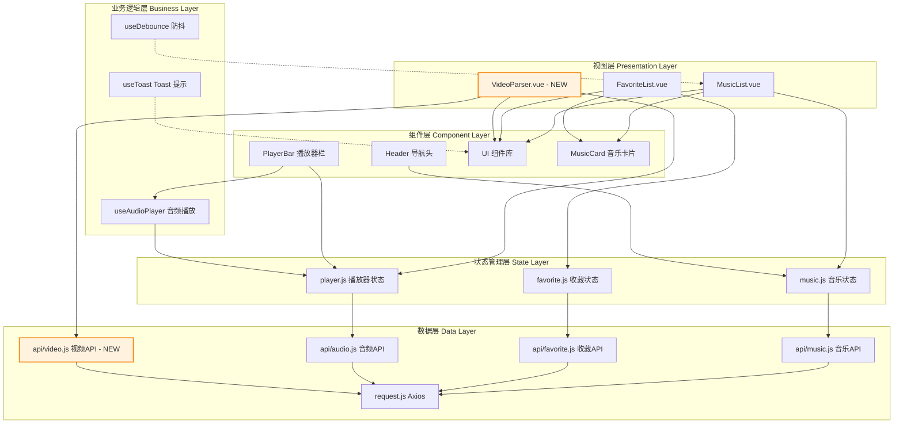

# 网易云音乐前端项目

> **最后更新：** 2026-02-01
> **项目状态：** 开发中
> **技术栈：** Vue 3 + Vite + Pinia + Tailwind CSS

---

## 变更记录 (Changelog)

### 2026-02-01
- 增量更新项目 AI 上下文文档
- 新增视频解析功能模块（B站视频转音频）
- 新增后端文档索引引用（不包含内容，仅索引路径）
- 新增模块结构图（Mermaid）
- 更新覆盖率报告（92% 覆盖率）
- 统计分析：48 个源文件，8 个模块，3 个页面

### 2026-01-30
- 添加后端服务对接章节
- 引用后端项目文档路径（CLAUDE.md、API 文档、测试指南）
- 添加后端模块结构说明
- 添加 API 快速参考和核心接口清单
- 添加前后端对接注意事项（响应格式、分页、异常处理等）
- 添加快速开发流程指引

### 2026-01-29
- 初始化项目文档
- 添加项目架构和技术栈说明
- 添加功能模块文档
- 添加开发规范

---

## 📋 项目概览

网易云音乐前端应用，基于 Vue 3 生态构建的现代化 SPA 单页应用，提供音乐浏览、收藏管理、在线播放和视频解析功能。

### 核心特性

- ✅ **音乐浏览** - 分页浏览音乐列表，支持关键词搜索
- ✅ **收藏管理** - 收藏/取消收藏音乐，查看收藏列表
- ✅ **音乐播放** - 完整的播放控制功能，支持多种播放模式
- ✅ **视频解析** - 支持 B 站视频解析并提取音频（NEW）
- ✅ **响应式设计** - 基于 Tailwind CSS 的现代化 UI
- ✅ **组件化开发** - 完善的 UI 组件库和业务组件

---

## 🏗️ 项目架构

### 模块结构图

```mermaid
graph TD
    Root["(根) wangyiyun-music-front<br/>网易云音乐前端"]

    Root --> Views["views<br/>页面视图（3个）"]
    Root --> Components["components<br/>组件库（28个）"]
    Root --> Stores["stores<br/>状态管理（3个）"]
    Root --> Composables["composables<br/>可组合函数（3个）"]
    Root --> API["api<br/>API 接口层（4个）"]
    Root --> Utils["utils<br/>工具函数（3个）"]
    Root --> Router["router<br/>路由配置（1个）"]
    Root --> Entry["入口<br/>App.vue + main.js"]

    Views --> ViewsModules["MusicList.vue<br/>FavoriteList.vue<br/>VideoParser.vue (NEW)"]

    Components --> UI["ui<br/>UI 组件库"]
    Components --> Player["player<br/>播放器组件"]
    Components --> Layout["layout<br/>布局组件"]
    Components --> Business["业务组件<br/>(MusicCard, MusicDetailDialog)"]

    Stores --> StoresModules["player.js<br/>music.js<br/>favorite.js"]

    Composables --> ComposablesModules["useAudioPlayer.js<br/>useToast.js<br/>useDebounce.js"]

    API --> APIModules["music.js<br/>favorite.js<br/>audio.js<br/>video.js (NEW)"]

    Utils --> UtilsModules["request.js<br/>audioFormat.js<br/>index.js"]

    click Views "#-功能模块" "查看页面视图"
    click Components "#4-ui-组件库" "查看组件库"
    click Stores "#-状态管理" "查看状态管理"
    click Composables "src/composables/CLAUDE.md" "查看可组合函数文档"
    click API "src/api/CLAUDE.md" "查看 API 文档"

    style Root fill:#e3f2fd,stroke:#1976d2,stroke-width:3px
    style Views fill:#fff3e0,stroke:#f57c00,stroke-width:2px
    style Components fill:#e8f5e9,stroke:#388e3c,stroke-width:2px
    style Stores fill:#f3e5f5,stroke:#7b1fa2,stroke-width:2px
    style Composables fill:#fce4ec,stroke:#c2185b,stroke-width:2px
    style API fill:#fff9c4,stroke:#f9a825,stroke-width:2px
    style Utils fill:#e0f2f1,stroke:#00796b,stroke-width:2px
    style Router fill:#ffebee,stroke:#d32f2f,stroke-width:2px
    style Entry fill:#f5f5f5,stroke:#616161,stroke-width:2px
```



### 技术栈

| 技术 | 版本 | 用途 |
|------|------|------|
| Vue | 3.5.24 | 前端框架（使用 Composition API） |
| Vite | 7.2.4 | 构建工具和开发服务器 |
| Pinia | 2.3.1 | 状态管理 |
| Vue Router | 4.6.4 | 路由管理 |
| Tailwind CSS | 4.1.18 | 样式框架 |
| Radix Vue | 1.9.17 | 无样式 UI 组件库 |
| Axios | 1.13.3 | HTTP 客户端 |
| Prettier | 3.8.1 | 代码格式化 |

### 目录结构

```
wangyiyun-music-front/
├── src/
│   ├── api/              # API 接口层（4个）
│   │   ├── music.js      # 音乐相关接口
│   │   ├── favorite.js   # 收藏相关接口
│   │   ├── audio.js      # 音频相关接口
│   │   └── video.js      # 视频解析接口 (NEW)
│   ├── components/       # 组件（28个）
│   │   ├── layout/       # 布局组件（Header）
│   │   ├── player/       # 播放器组件（6个）
│   │   ├── ui/           # UI 组件库（9个组件）
│   │   ├── MusicCard.vue # 音乐卡片组件
│   │   └── MusicDetailDialog.vue # 音乐详情对话框
│   ├── composables/      # 可组合函数（3个）
│   │   ├── useAudioPlayer.js  # 音频播放器逻辑
│   │   ├── useToast.js        # Toast 提示
│   │   └── useDebounce.js     # 防抖函数
│   ├── stores/           # Pinia 状态管理（3个）
│   │   ├── player.js     # 播放器状态
│   │   ├── music.js      # 音乐列表状态
│   │   └── favorite.js   # 收藏状态
│   ├── utils/            # 工具函数（3个）
│   │   ├── request.js    # Axios 封装
│   │   ├── audioFormat.js # 音频格式处理
│   │   └── index.js      # 工具函数导出
│   ├── views/            # 页面视图（3个）
│   │   ├── MusicList.vue   # 音乐列表页
│   │   ├── FavoriteList.vue # 收藏列表页
│   │   └── VideoParser.vue # 视频解析页 (NEW)
│   ├── router/           # 路由配置
│   │   └── index.js      # 路由定义（3个路由）
│   ├── App.vue           # 根组件
│   └── main.js           # 应用入口
├── public/               # 静态资源
├── .claude/              # AI 上下文索引
│   └── index.json        # 项目索引 JSON
├── package.json
├── vite.config.js        # Vite 配置
├── .prettierrc.cjs       # Prettier 配置
└── index.html            # HTML 入口
```

### 架构图



---

## 🚀 快速开始

### 环境要求

- Node.js >= 18
- npm 或 pnpm

### 安装依赖

```bash
npm install
```

### 开发模式

```bash
npm run dev
```

访问 http://localhost:5173

### 构建生产版本

```bash
npm run build
```

### 代码格式化

```bash
# 格式化代码
npm run format

# 检查格式
npm run format:check
```

---

## 📦 功能模块

### 1. 音乐列表模块

**路由：** `/music`

**功能：**
- 分页浏览音乐列表
- 关键词搜索（歌曲名/歌手名）
- 查看音乐详情
- 播放音乐
- 收藏/取消收藏

**相关文件：**
- [src/views/MusicList.vue](src/views/MusicList.vue)
- [src/stores/music.js](src/stores/music.js)
- [src/api/music.js](src/api/music.js)

**文档：** [src/views/CLAUDE.md](src/views/CLAUDE.md)

---

### 2. 收藏管理模块

**路由：** `/favorites`

**功能：**
- 查看收藏列表
- 分页浏览
- 取消收藏
- 播放收藏的音乐

**相关文件：**
- [src/views/FavoriteList.vue](src/views/FavoriteList.vue)
- [src/stores/favorite.js](src/stores/favorite.js)
- [src/api/favorite.js](src/api/favorite.js)

**文档：** [src/views/CLAUDE.md](src/views/CLAUDE.md)

---

### 3. 音乐播放器模块

**功能：**
- 播放/暂停控制
- 上一曲/下一曲
- 进度条拖动
- 音量控制
- 播放模式切换（顺序/随机/单曲循环）
- 播放列表管理

**相关文件：**
- [src/components/player/](src/components/player/)
  - PlayerBar.vue - 播放器栏主组件
  - PlayerControls.vue - 播放控制按钮
  - PlayerInfo.vue - 当前歌曲信息
  - PlayerProgress.vue - 进度条
  - PlayerVolume.vue - 音量控制
  - PlayerPlaylist.vue - 播放列表
- [src/stores/player.js](src/stores/player.js)
- [src/composables/useAudioPlayer.js](src/composables/useAudioPlayer.js)
- [src/api/audio.js](src/api/audio.js)

**文档：** [src/stores/CLAUDE.md](src/stores/CLAUDE.md) | [src/composables/CLAUDE.md](src/composables/CLAUDE.md)

---

### 4. 视频解析模块 (NEW)

**路由：** `/video-parser`

**功能：**
- 支持 B 站视频链接解析
- 提取视频音频流并转换为 MP3 格式
- 显示视频元数据（标题、时长、封面）
- 支持在线播放提取的音频
- 支持下载音频文件
- 音频文件临时存储（1小时有效期）

**相关文件：**
- [src/views/VideoParser.vue](src/views/VideoParser.vue)
- [src/api/video.js](src/api/video.js)
- [src/stores/player.js](src/stores/player.js)

**后端对接：**
- 后端服务：`VideoParseController` + `YtDlpService`
- API 接口：`POST /api/video/parse`
- 解析工具：yt-dlp（外部依赖）
- 临时文件路径：`D:/music-data/temp-audio/`
- 有效期：1 小时（后端定时清理）

**支持平台：**
- ✅ 哔哩哔哩（Bilibili）- 完全支持
- 🚧 YouTube - 即将支持
- 🚧 抖音 - 即将支持

---

### 5. UI 组件库

基于 Radix Vue 和 Tailwind CSS 构建的无障碍 UI 组件。

**组件列表：**
- Button - 按钮
- Card - 卡片
- Input - 输入框
- Dialog - 对话框
- Pagination - 分页
- Skeleton - 骨架屏
- Toast - 提示框

**相关文件：**
- [src/components/ui/](src/components/ui/)

**文档：** [src/components/ui/CLAUDE.md](src/components/ui/CLAUDE.md)

---

## 🔧 开发规范

### 代码风格

- 使用 **Prettier** 进行代码格式化
- 遵循 **Vue 3 Composition API** 最佳实践
- 使用 **ESLint**（待配置）

### Prettier 配置

**文件：** `.prettierrc.cjs`

```javascript
{
  printWidth: 150,
  tabWidth: 2,
  useTabs: true,
  semi: false,
  singleQuote: true,
  trailingComma: 'es5',
  // ...
}
```

### 命名规范

- **组件文件：** PascalCase（如 `MusicCard.vue`）
- **工具函数文件：** camelCase（如 `useAudioPlayer.js`）
- **组件名：** PascalCase（多单词）或 PascalCase（单单词大写开头）

### 注释规范

- 关键函数必须添加 JSDoc 注释
- 复杂逻辑需要添加行内注释说明
- 接口定义需要注释参数和返回值

### Git 提交规范

使用 Conventional Commits 规范：

- `feat`: 新功能
- `fix`: 修复 bug
- `docs`: 文档更新
- `style`: 代码格式调整
- `refactor`: 重构代码
- `test`: 测试相关
- `chore`: 构建/工具链相关

---

## 🔌 API 接口

### 基础配置

- **Base URL：** `/api`（通过 Vite 代理转发到 `http://localhost:8910`）
- **超时时间：** 10000ms
- **响应格式：** `{ code: 200, message: '操作成功', data: ... }`

### 主要接口

#### 音乐相关

- `GET /music/list` - 分页查询音乐列表
- `GET /music/{id}` - 获取音乐详情

#### 收藏相关

- `POST /favorite/{musicId}` - 收藏音乐
- `DELETE /favorite/{musicId}` - 取消收藏
- `GET /favorite/list` - 查询收藏列表

#### 音频相关

- `GET /audio/{id}` - 获取音频访问 URL

#### 视频解析相关 (NEW)

- `POST /video/parse` - 解析视频并提取音频
- `GET /video/platforms` - 获取支持的平台列表

**详细文档：** [src/api/CLAUDE.md](src/api/CLAUDE.md)

---

## 🔗 后端服务对接

### 后端项目路径

**后端项目位置：** `D:\JavaCodeStudy\wangyiyun-music`

**技术栈：** Spring Boot 3.1.0 + Java 17 + MySQL + MyBatis-Plus

**服务地址：**
- 开发环境：http://localhost:8910
- Swagger 文档：http://localhost:8910/swagger-ui/index.html

### 后端文档索引

> **说明：** 以下仅为后端文档的索引引用，不包含后端文档内容。具体内容请查看后端项目文档。

#### 核心文档

| 文档 | 路径 | 说明 |
|------|------|------|
| **后端 AI 上下文** | `D:\JavaCodeStudy\wangyiyun-music\CLAUDE.md` | 后端项目完整架构、模块索引、开发规范 |
| **后端索引 JSON** | `D:\JavaCodeStudy\wangyiyun-music\.claude\index.json` | 后端项目元数据、模块结构、覆盖率报告 |
| **API 接口文档** | `D:\JavaCodeStudy\wangyiyun-music\docs\API接口文档.md` | 完整 API 接口清单、请求/响应格式、数据模型 |
| **API 测试指南** | `D:\JavaCodeStudy\wangyiyun-music\docs\API测试指南.md` | 接口测试流程、cURL 示例、常见问题 |

#### 后端模块概览

后端项目包含以下核心模块：

- **Controller 层**（11个控制器）- RESTful API 接口
- **Service 层**（29个服务类）- 业务逻辑处理
- **Mapper 层**（9个 Mapper）- MyBatis-Plus 数据访问
- **Model 层**（17个数据模型）- 实体、DTO、VO
- **Config 层**（7个配置类）- Spring 配置
- **Filter 层**（2个过滤器）- 限流、防盗链
- **Exception 层**（6个异常类）- 全局异常处理

**新增功能：**
- ✅ 视频解析服务（B站支持）
- ✅ 音频资源安全（限流 + 防盗链）
- ✅ 临时文件管理（定时清理）

### API 快速参考

#### 统一响应格式

```json
{
  "code": 200,
  "message": "操作成功",
  "data": { ... }
}
```

**说明：**
- 后端使用 `GlobalResponseAdvice` 自动封装所有响应为 `Result<T>` 格式
- Controller 方法可直接返回业务对象，无需手动包装

#### 核心接口清单

| 功能模块 | 接口 | 方法 | 说明 |
|---------|------|------|------|
| **音乐管理** | `/api/music/list` | GET | 分页查询音乐列表（支持关键词搜索、排序）|
| | `/api/music/{id}` | GET | 获取音乐详情（包含歌手、专辑、标签）|
| **收藏管理** | `/api/favorite/{musicId}` | POST | 收藏音乐 |
| | `/api/favorite/{musicId}` | DELETE | 取消收藏 |
| | `/api/favorite/list` | GET | 查询收藏列表（分页）|
| **音频播放** | `/api/audio/{musicId}` | GET | 获取音频访问 URL（支持 HTTP Range 请求）|
| **视频解析** | `/api/video/parse` | POST | 解析视频并提取音频（B站/YouTube）|
| | `/api/video/platforms` | GET | 获取支持的平台列表 |
| **播放记录** | `/api/play-record` | POST | 记录播放 |
| | `/api/play-record/history` | GET | 查询播放历史（分页）|

#### 关键数据模型

**MusicListVO** (音乐列表视图对象)
```javascript
{
  id: Long,              // 音乐ID
  title: String,         // 歌曲名称
  fileUrl: String,       // 音频文件URL
  coverUrl: String,      // 封面图片URL
  duration: Integer,     // 时长（秒）
  playCount: Integer,    // 播放量
  artistNames: String,   // 歌手名称（多个用 "/" 分隔）
  categoryId: Long,      // 分类ID
  createTime: DateTime   // 创建时间
}
```

**AudioUrlVO** (音频 URL 视图对象)
```javascript
{
  musicId: Long,        // 音乐ID
  audioUrl: String      // 音频访问URL (http://localhost:8910/audio/xxx.mp3)
}
```

**VideoParseResultVO** (视频解析结果视图对象) - NEW
```javascript
{
  sourceVideoId: String,    // 源视频ID（如 BV1xxx）
  platform: String,         // 平台类型（BILIBILI/YOUTUBE）
  title: String,            // 标题
  audioUrl: String,         // 音频访问URL
  audioFormat: String,      // 音频格式（mp3/m4a）
  coverUrl: String,         // 封面图URL
  duration: Integer,        // 时长（秒）
  fileSize: Long,           // 文件大小（字节）
  expiresAt: DateTime       // 过期时间（1小时后）
}
```

### 关键配置信息

#### 后端配置 (application.yaml)

```yaml
server:
  port: 8910

# 音频文件配置
audio:
  storage-path: file:D:/music-data/audio/
  url-prefix: /audio/
  server-base-url: http://localhost:${server.port}

# 视频解析配置 (NEW)
video:
  parse:
    yt-dlp-path: ${user.dir}/tools/yt-dlp.exe
    temp-storage-path: D:/music-data/temp-audio/
    max-file-size-mb: 100
    storage-capacity-mb: 1024

# 数据库配置
spring:
  datasource:
    url: jdbc:mysql://localhost:3306/wangyiyun_music
```

#### 前端代理配置 (vite.config.js)

```javascript
server: {
  proxy: {
    '/api': {
      target: 'http://localhost:8910',
      changeOrigin: true
    }
  }
}
```

### 前后端对接注意事项

#### 1. 响应数据提取

前端需要从统一响应格式中提取 `data` 字段：

```javascript
// src/utils/request.js
response.interceptors.use(
  (response) => {
    const { code, data, message } = response.data
    if (code === 200) {
      return data  // 只返回 data 部分
    }
    // 错误处理...
  }
)
```

#### 2. 音频播放支持

- 后端已配置 HTTP Range 请求支持（WebMvcConfig），支持拖拽播放
- 音频 URL 格式：`http://localhost:8910/audio/{filename}.mp3`
- 通过 `/api/audio/{musicId}` 接口获取音频 URL

#### 3. 视频解析注意事项 (NEW)

- **临时文件有效期**：音频文件 1 小时后自动删除
- **支持格式**：URL、BV号、分享文本（包含链接）
- **文件大小限制**：单文件不超过 100MB
- **存储容量限制**：临时目录总容量不超过 1GB
- **平台支持**：当前仅支持 B 站，YouTube 和抖音即将支持
- **错误处理**：前端应处理解析失败、文件过大、存储容量不足等异常

#### 4. 歌手名称显示

- 音乐列表接口返回 `artistNames` 字段（已聚合）
- 多个歌手用 `"/"` 分隔（例如："周杰伦/方文山"）
- 音乐详情接口返回完整 `artists` 数组

#### 5. 分页参数

后端使用 MyBatis-Plus 分页，响应格式：

```json
{
  "records": [...],    // 数据列表
  "total": 100,        // 总记录数
  "pages": 10,         // 总页数
  "current": 1,        // 当前页码
  "size": 10          // 每页大小
}
```

#### 6. 异常处理

- 后端使用 `GlobalExceptionHandler` 统一异常处理
- 业务异常返回格式：`{ code: 500, message: "错误信息", data: null }`
- 前端应在 Axios 拦截器中统一处理错误响应

#### 7. 开发调试

- **后端日志：** 查看 IDEA 控制台或日志文件
- **Swagger 文档：** http://localhost:8910/swagger-ui/index.html（可直接测试接口）
- **数据库查看：** 使用 IDEA Database 工具或 Navicat

### 快速开发流程

1. **查看后端文档** - 了解接口定义和数据模型
2. **查看 Swagger** - 确认接口格式和测试数据
3. **编写前端 API 方法** - 在 [src/api/](src/api/) 中定义接口调用
4. **测试接口** - 使用 Swagger 或 cURL 验证接口
5. **集成到前端** - 在组件中调用 API 并处理响应

### 相关资源

- **后端启动方式：** 在 IDEA 中运行 `WangyiyunMusicApplication.java`
- **后端 Maven 命令：** `mvn spring-boot:run`
- **Swagger UI 文档：** [http://localhost:8910/swagger-ui/index.html](http://localhost:8910/swagger-ui/index.html)
- **数据库：** MySQL 8.0+，数据库名 `wangyiyun_music`

---

## 📊 状态管理

### Player Store (播放器状态)

**路径：** [src/stores/player.js](src/stores/player.js)

**状态：**
- `currentTrack` - 当前播放歌曲
- `isPlaying` - 播放状态
- `currentTime` - 当前时间
- `duration` - 总时长
- `volume` - 音量
- `playlist` - 播放列表
- `playMode` - 播放模式
- `currentAudioSource` - 当前音频源

**文档：** [src/stores/CLAUDE.md](src/stores/CLAUDE.md)

### Music Store (音乐状态)

**路径：** [src/stores/music.js](src/stores/music.js)

**状态：**
- `musicList` - 音乐列表
- `total` - 总记录数
- `searchParams` - 搜索参数

**文档：** [src/stores/CLAUDE.md](src/stores/CLAUDE.md)

### Favorite Store (收藏状态)

**路径：** [src/stores/favorite.js](src/stores/favorite.js)

**状态：**
- `favoriteList` - 收藏列表
- `favoriteIds` - 收藏 ID 集合
- `total` - 总收藏数

**文档：** [src/stores/CLAUDE.md](src/stores/CLAUDE.md)

---

## 🎨 样式系统

使用 **Tailwind CSS v4** + **Radix Vue** 构建样式系统。

### 主题配置

- **颜色方案：** 待配置
- **字体：** 待配置
- **断点：** 使用 Tailwind 默认断点

### 样式规范

- 优先使用 Tailwind 工具类
- 复杂组件使用 scoped CSS
- 避免内联样式

---

## 🐛 已知问题

暂无

---

## 📝 待办事项

- [ ] 添加 ESLint 配置
- [ ] 完善单元测试（建议覆盖率 > 70%）
- [ ] 添加 E2E 测试（Playwright/Cypress）
- [ ] 实现用户认证功能（对接后端）
- [ ] 添加音乐分类筛选
- [ ] 实现播放列表持久化（localStorage）
- [ ] 添加歌词显示功能（lrc 解析）
- [ ] 优化移动端适配
- [ ] 完善视频解析功能（YouTube、抖音支持）
- [ ] 补充工具函数、路由、播放器组件的模块文档

---

## 📚 模块文档

详细模块文档请查看各模块目录下的 `CLAUDE.md`：

| 模块 | 文档路径 |
|------|----------|
| API 层 | [src/api/CLAUDE.md](src/api/CLAUDE.md) |
| UI 组件库 | [src/components/ui/CLAUDE.md](src/components/ui/CLAUDE.md) |
| 状态管理 | [src/stores/CLAUDE.md](src/stores/CLAUDE.md) |
| 可组合函数 | [src/composables/CLAUDE.md](src/composables/CLAUDE.md) |
| 页面视图 | [src/views/CLAUDE.md](src/views/CLAUDE.md) |
| 工具函数 | src/utils/CLAUDE.md（待补充）|
| 路由配置 | src/router/CLAUDE.md（待补充）|

---

## 📊 项目元数据

### 统计信息

- **源文件总数**：48个
- **模块数量**：8个
- **页面数量**：3个
- **组件数量**：28个
- **API 接口数量**：4个
- **Store 数量**：3个
- **Composables 数量**：3个

### 覆盖率报告

- **扫描策略**：自适应混合（轻量清点 + 模块优先扫描）
- **总文件估算**：52个
- **已扫描文件**：48个
- **覆盖率**：92%
- **忽略模式**：`node_modules/**, dist/**, dist-ssr/**, *.local, .vscode/**, .idea/**`

### 主要缺口

- **缺少测试**：src/api/**, src/components/**, src/composables/**, src/stores/**, src/utils/**, src/views/**
- **缺少文档**：src/utils/CLAUDE.md, src/router/CLAUDE.md, src/components/player/CLAUDE.md

### 推荐下一步

1. 补充单元测试（建议覆盖率 > 70%）
2. 为新增的视频解析功能添加端到端测试
3. 补充工具函数、路由、播放器组件的模块文档
4. 添加 ESLint 配置以增强代码质量检查
5. 优化移动端适配与响应式设计
6. 实现用户认证功能（对接后端）
7. 添加歌词显示功能
8. 实现播放列表持久化

---

## 📄 许可证

MIT

---

## 👥 贡献

欢迎提交 Issue 和 Pull Request！

---

**最后更新：** 2026-02-01 16:01:33
**文档版本：** 1.2.0
**生成方式：** AI 自动生成并增量更新
