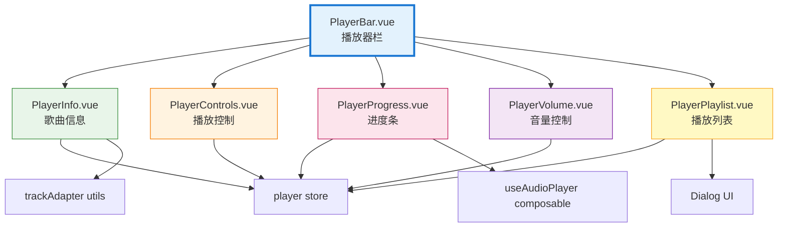

# 播放器组件模块 (Player Components)

> **导航：** [项目根目录](../../../CLAUDE.md) > [src](../../CLAUDE.md) > [components](../CLAUDE.md) > player
>
> **最后更新：** 2026-02-07
> **文件数量：** 6 个
> **职责：** 音频播放器 UI 组件、播放控制、进度管理、音量控制、播放列表

---

## 📋 模块概览

播放器组件模块提供完整的音频播放器界面，包括播放控制、进度条、音量控制、播放列表等功能组件。所有组件采用组合式 API 开发，与播放器状态管理（`stores/player`）紧密集成。

### 核心功能

- ✅ **播放控制** - 播放/暂停、上一曲/下一曲按钮
- ✅ **进度管理** - 可拖拽进度条、时间显示
- ✅ **音量控制** - 音量滑块、静音切换
- ✅ **播放列表** - 列表显示、歌曲切换、列表管理
- ✅ **歌曲信息** - 封面、标题、歌手、临时文件标识
- ✅ **播放模式** - 顺序播放、随机播放、单曲循环
- ✅ **响应式布局** - 桌面端和移动端适配

### 文件列表

| 文件 | 职责 | 依赖 |
|------|------|------|
| [PlayerBar.vue](#1-playerbar-播放器栏) | 播放器主容器，布局管理 | 所有子组件 |
| [PlayerControls.vue](#2-playercontrols-播放控制) | 播放/暂停、上一曲/下一曲按钮 | player store |
| [PlayerInfo.vue](#3-playerinfo-歌曲信息) | 当前歌曲信息显示 | player store, trackAdapter |
| [PlayerProgress.vue](#4-playerprogress-进度条) | 进度条、时间显示、拖拽控制 | player store, useAudioPlayer |
| [PlayerVolume.vue](#5-playervolume-音量控制) | 音量滑块、静音按钮 | player store |
| [PlayerPlaylist.vue](#6-playerplaylist-播放列表) | 播放列表弹窗 | player store, Dialog |

---

## 组件结构图



---

## 1. PlayerBar (播放器栏)

### 功能说明

播放器主容器组件，负责整体布局和子组件组合，提供固定在页面底部的播放器栏。

### 核心特性

- ✅ **固定布局** - 固定在页面底部，z-index 为 50
- ✅ **响应式设计** - 桌面端和移动端不同布局
- ✅ **播放模式切换** - 顺序播放、随机播放、单曲循环
- ✅ **播放列表弹窗** - 控制播放列表显示/隐藏
- ✅ **空状态处理** - 无歌曲时隐藏播放器

### 布局结构

#### 桌面端布局（md 及以上）

```
┌─────────────────────────────────────────────────────────┐
│  [歌曲信息]  |  [播放控制 + 进度条]  |  [模式/音量/列表]  │
│                                                         │
└─────────────────────────────────────────────────────────┘
```

#### 移动端布局（md 以下）

```
┌─────────────────────────────┐
│  [歌曲信息]  |  [播放控制]  │
│──────────────────────────────│
│       [进度条]                │
└─────────────────────────────┘
```

### Props

无

### 使用示例

```vue
<template>
  <div id="app">
    <!-- 页面内容 -->

    <!-- 播放器栏（固定在底部） -->
    <PlayerBar />
  </div>
</template>

<script setup>
import PlayerBar from '@/components/player/PlayerBar.vue'
</script>
```

### 播放模式

| 模式 | 常量 | 图标颜色 | 说明 |
|------|------|----------|------|
| 顺序播放 | `PLAY_MODES.SEQUENTIAL` | 灰色 | 按播放列表顺序播放 |
| 随机播放 | `PLAY_MODES.RANDOM` | 红色 | 随机选择下一首歌曲 |
| 单曲循环 | `PLAY_MODES.REPEAT_ONE` | 红色 | 重复播放当前歌曲 |

---

## 2. PlayerControls (播放控制)

### 功能说明

提供播放/暂停、上一曲、下一曲三个核心播放控制按钮。

### 核心特性

- ✅ **播放/暂停切换** - 根据播放状态显示不同图标
- ✅ **上一曲/下一曲** - 支持禁用状态（无上/下一曲时）
- ✅ **按钮状态管理** - 自动根据播放列表状态禁用按钮

### Props

无

### 按钮状态

| 按钮 | 禁用条件 | 依赖状态 |
|------|----------|----------|
| **上一曲** | `!hasPrevious` | `currentIndex > 0` |
| **播放/暂停** | `!currentTrack` | 有当前歌曲 |
| **下一曲** | `!hasNext` | `currentIndex < playlist.length - 1` |

### 使用示例

```vue
<template>
  <PlayerControls />
</template>

<script setup>
import PlayerControls from '@/components/player/PlayerControls.vue'
</script>
```

---

## 3. PlayerInfo (歌曲信息)

### 功能说明

显示当前播放歌曲的信息，包括封面、标题、歌手名、临时文件标识和过期时间提示。

### 核心特性

- ✅ **封面显示** - 歌曲封面图片 + 默认图标
- ✅ **歌曲信息** - 标题和歌手名（自动截断）
- ✅ **临时文件标识** - 视频解析临时文件显示"临时"标签
- ✅ **过期时间提示** - 显示剩余有效时间（如"45 分钟后过期"）

### Props

无

### 临时文件标识

使用 `trackAdapter` 工具函数判断和显示临时文件信息：

```javascript
import { isTemporaryTrack, getExpiryHint } from '@/utils/trackAdapter'

// 检查是否为临时文件
isTemporaryTrack(currentTrack)

// 获取过期时间提示
getExpiryHint(currentTrack) // => '45 分钟后过期'
```

### 显示状态

| 状态 | 显示内容 |
|------|----------|
| **有歌曲** | 封面 + 标题 + 歌手名 |
| **临时文件** | 标题 + "临时"标签 + 过期时间 |
| **无歌曲** | "暂无播放" |

### 使用示例

```vue
<template>
  <PlayerInfo />
</template>

<script setup>
import PlayerInfo from '@/components/player/PlayerInfo.vue'
</script>
```

---

## 4. PlayerProgress (进度条)

### 功能说明

音频播放进度条组件，支持拖拽调整播放位置，显示当前时间和总时长。

### 核心特性

- ✅ **拖拽控制** - 鼠标拖拽调整播放位置
- ✅ **时间显示** - 当前时间 / 总时长（格式：mm:ss）
- ✅ **视觉反馈** - 渐变背景显示播放进度
- ✅ **滑块显示** - Hover 时显示圆形滑块

### Props

无

### 进度条样式

```javascript
// 使用线性渐变显示进度
const progress = (currentTime / duration) * 100
background: `linear-gradient(to right,
  #ef4444 0%,
  #ef4444 ${progress}%,
  #e5e7eb ${progress}%,
  #e5e7eb 100%
)`
```

### 拖拽流程

1. **拖拽开始** (`mousedown`) - 设置 `isSeeking = true`
2. **拖拽中** (`input`) - 实时更新 Store 状态
3. **拖拽结束** (`mouseup`) - 更新 Audio 元素位置

### 使用示例

```vue
<template>
  <PlayerProgress />
</template>

<script setup>
import PlayerProgress from '@/components/player/PlayerProgress.vue'
</script>
```

### 注意事项

- 拖拽时需要同时更新 Store 状态和 Audio 元素
- 使用 `useAudioPlayer().seek()` 方法同步音频位置

---

## 5. PlayerVolume (音量控制)

### 功能说明

音量控制组件，提供音量滑块和静音切换功能。

### 核心特性

- ✅ **音量滑块** - 调整音量（0-100%）
- ✅ **静音切换** - 一键静音/恢复音量
- ✅ **图标切换** - 根据音量显示不同图标
- ✅ **音量记忆** - 静音前记住音量，恢复时使用
- ✅ **响应式显示** - 滑块仅在桌面端显示

### Props

无

### 音量图标

| 音量范围 | 图标 | 说明 |
|---------|------|------|
| `0` | 静音图标 | 音量为 0 或已静音 |
| `0 < volume <= 0.5` | 低音量图标 | 音量 1%-50% |
| `0.5 < volume <= 1` | 高音量图标 | 音量 51%-100% |

### 静音逻辑

```javascript
// 静音
if (volume > 0) {
  volumeBeforeMute = volume
  setVolume(0)
}

// 恢复音量
if (volume === 0) {
  setVolume(volumeBeforeMute || 0.8) // 默认恢复 80%
}
```

### 使用示例

```vue
<template>
  <PlayerVolume />
</template>

<script setup>
import PlayerVolume from '@/components/player/PlayerVolume.vue'
</script>
```

---

## 6. PlayerPlaylist (播放列表)

### 功能说明

播放列表弹窗组件，显示完整播放列表，支持切换歌曲、移除歌曲、清空列表。

### 核心特性

- ✅ **列表显示** - 显示所有播放列表歌曲
- ✅ **当前播放标识** - 高亮当前播放歌曲
- ✅ **歌曲切换** - 点击歌曲切换播放
- ✅ **移除歌曲** - 从列表移除单个歌曲
- ✅ **清空列表** - 一键清空所有歌曲（带确认）
- ✅ **空状态** - 列表为空时显示提示

### Props

| 属性 | 类型 | 必填 | 说明 |
|------|------|------|------|
| `open` | `Boolean` | ✅ | 弹窗显示状态 |

### Emits

| 事件 | 参数 | 说明 |
|------|------|------|
| `update:open` | `Boolean` | 更新弹窗显示状态 |

### 列表项显示

| 元素 | 说明 |
|------|------|
| **序号/图标** | 正在播放显示播放/暂停图标，否则显示序号 |
| **歌曲信息** | 标题 + 歌手名 |
| **删除按钮** | Hover 时显示，点击移除歌曲 |

### 交互逻辑

```javascript
// 点击歌曲
if (点击的是当前播放歌曲) {
  togglePlay() // 切换播放/暂停
} else {
  playTrack(index) // 切换到指定歌曲
}
```

### 使用示例

```vue
<template>
  <PlayerPlaylist v-model:open="playlistVisible" />
</template>

<script setup>
import { ref } from 'vue'
import PlayerPlaylist from '@/components/player/PlayerPlaylist.vue'

const playlistVisible = ref(false)
</script>
```

---

## 📦 依赖关系

### 外部依赖

- `vue` (v3.5.24) - Vue 3 框架
- `pinia` (v2.3.1) - 状态管理

### 内部依赖

| 依赖 | 类型 | 说明 |
|------|------|------|
| `@/stores/player` | Store | 播放器状态管理 |
| `@/composables/useAudioPlayer` | Composable | 音频播放器逻辑 |
| `@/utils/audioFormat` | Utils | 音频格式处理工具 |
| `@/utils/trackAdapter` | Utils | 音轨数据适配器 |
| `@/components/ui/dialog/Dialog` | Component | UI 对话框组件 |

---

## 🔧 使用示例

### 示例 1：完整播放器

```vue
<template>
  <div id="app">
    <!-- 导航头 -->
    <Header />

    <!-- 页面路由 -->
    <router-view />

    <!-- 播放器栏（固定底部） -->
    <PlayerBar />
  </div>
</template>

<script setup>
import PlayerBar from '@/components/player/PlayerBar.vue'
import Header from '@/components/layout/Header.vue'
</script>

<style>
/* 为播放器留出底部空间 */
#app {
  padding-bottom: 80px; /* 播放器高度 */
}
</style>
```

### 示例 2：自定义播放器布局

```vue
<template>
  <div class="custom-player">
    <!-- 歌曲信息 -->
    <PlayerInfo />

    <!-- 播放控制 -->
    <PlayerControls />

    <!-- 进度条 -->
    <PlayerProgress />

    <!-- 音量控制 -->
    <PlayerVolume />

    <!-- 播放列表 -->
    <PlayerPlaylist v-model:open="playlistVisible" />
  </div>
</template>

<script setup>
import { ref } from 'vue'
import PlayerInfo from '@/components/player/PlayerInfo.vue'
import PlayerControls from '@/components/player/PlayerControls.vue'
import PlayerProgress from '@/components/player/PlayerProgress.vue'
import PlayerVolume from '@/components/player/PlayerVolume.vue'
import PlayerPlaylist from '@/components/player/PlayerPlaylist.vue'

const playlistVisible = ref(false)
</script>
```

---

## ⚠️ 注意事项

### 1. 播放器初始化

`PlayerBar` 组件在 `<script setup>` 中调用 `useAudioPlayer()`，确保音频播放器逻辑初始化：

```javascript
// PlayerBar.vue
const { } = useAudioPlayer() // 初始化音频播放器
```

**重要：** 仅在 `PlayerBar` 中初始化一次，避免重复初始化。

### 2. 进度条拖拽

拖拽进度条时需要同时更新两个位置：
- Store 状态：`playerStore.updateTime(newTime)`
- Audio 元素：`seekAudio(newTime)`

```javascript
// 拖拽结束
function handleSeekEnd(event) {
  const newTime = parseFloat(event.target.value)
  playerStore.seek(newTime)     // 更新 Store
  seekAudio(newTime)             // 更新 Audio 元素
}
```

### 3. 响应式布局

播放器使用 Tailwind CSS 的响应式类：
- **桌面端**：`md:flex` - 显示完整布局
- **移动端**：`md:hidden` - 简化布局，隐藏部分功能

```vue
<!-- 仅桌面端显示 -->
<div class="hidden md:block">
  <PlayerVolume />
</div>

<!-- 仅移动端显示 -->
<div class="md:hidden">
  <PlayerProgress />
</div>
```

### 4. 临时文件标识

视频解析的临时文件需要显示"临时"标签和过期时间：

```vue
<span
  v-if="isTemporaryTrack(currentTrack)"
  class="inline-flex items-center rounded bg-amber-100 px-1.5 py-0.5 text-xs"
>
  临时
</span>
<span v-if="expiryHint">{{ expiryHint }}</span>
```

### 5. 播放列表徽章

播放列表按钮显示列表数量徽章，超过 99 显示 "99+"：

```vue
<span class="badge">
  {{ playlist.length > 99 ? '99+' : playlist.length }}
</span>
```

---

## 🎨 样式规范

### 颜色主题

| 元素 | 颜色 | Tailwind 类 |
|------|------|-------------|
| **主色调** | 红色 | `bg-red-500`, `text-red-500` |
| **进度条** | 红色 | `#ef4444` |
| **背景** | 白色 | `bg-white` |
| **边框** | 灰色 | `border-gray-200` |
| **图标** | 灰色 | `text-gray-600` |
| **激活状态** | 红色背景 | `bg-red-50` |

### 尺寸规范

| 元素 | 高度 | 宽度 |
|------|------|------|
| **播放器栏（桌面）** | `80px` (h-20) | 100% |
| **播放器栏（移动）** | `64px` (h-16) | 100% |
| **播放按钮** | `40px` (h-10) | `40px` (w-10) |
| **控制按钮** | `32px` (h-8) | `32px` (w-8) |
| **封面图** | `48px` (h-12) | `48px` (w-12) |

---

## 🧪 测试建议

### 单元测试清单

- [ ] **PlayerControls** - 测试播放/暂停、上一曲/下一曲逻辑
- [ ] **PlayerProgress** - 测试拖拽进度条、时间格式化
- [ ] **PlayerVolume** - 测试音量调整、静音切换
- [ ] **PlayerInfo** - 测试歌曲信息显示、临时文件标识
- [ ] **PlayerPlaylist** - 测试列表操作、歌曲切换、清空列表

### E2E 测试清单

- [ ] 播放/暂停功能
- [ ] 上一曲/下一曲切换
- [ ] 进度条拖拽调整播放位置
- [ ] 音量调整和静音
- [ ] 播放列表显示和操作
- [ ] 播放模式切换
- [ ] 移动端和桌面端布局适配

---

## 📝 待办事项

- [ ] 添加单元测试（覆盖率 > 80%）
- [ ] 添加键盘快捷键支持（空格播放/暂停、方向键调整音量）
- [ ] 添加播放列表拖拽排序功能
- [ ] 添加迷你播放器模式（收起播放器栏）
- [ ] 添加歌词显示功能
- [ ] 添加音频可视化效果
- [ ] 添加播放历史记录
- [ ] 优化移动端滑动手势控制
- [ ] 添加播放速度控制

---

## 🔗 相关文档

| 文档 | 说明 |
|------|------|
| [项目根文档](../../../CLAUDE.md) | 项目完整架构和模块索引 |
| [Player Store](../../stores/CLAUDE.md#1-playerjs-播放器状态管理) | 播放器状态管理文档 |
| [useAudioPlayer](../../composables/CLAUDE.md#1-useaudioplayerjs-音频播放器) | 音频播放器 Composable 文档 |
| [trackAdapter](../../utils/CLAUDE.md#3-trackadapterjs-音轨数据适配器) | 音轨数据适配器文档 |

---

**最后更新：** 2026-02-07 00:05:33
**文档版本：** 1.0.0
**维护者：** AI 自动生成
