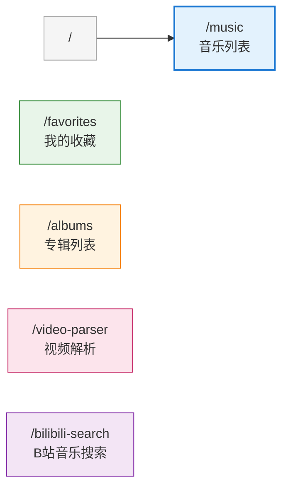
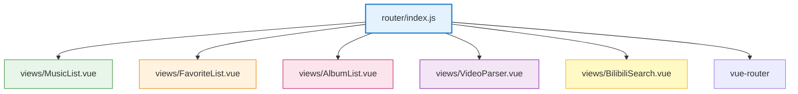

# 路由配置模块 (Router)

> **导航：** [项目根目录](../../CLAUDE.md) > [src](../CLAUDE.md) > router
>
> **最后更新：** 2026-02-07
> **文件数量：** 1 个
> **职责：** Vue Router 配置、路由定义、页面导航

---

## 📋 模块概览

路由配置模块使用 Vue Router 4 管理应用的页面导航，支持懒加载、路由元信息和编程式导航。

### 核心功能

- ✅ **路由定义** - 定义 5 个页面路由，支持懒加载
- ✅ **默认路由** - 首页重定向到音乐列表页
- ✅ **路由元信息** - 为每个路由添加页面标题
- ✅ **History 模式** - 使用 HTML5 History API

### 文件列表

| 文件 | 导出内容 | 职责 |
|------|----------|------|
| [index.js](#indexjs-路由配置) | `router` (default) | Vue Router 实例，路由表定义 |

---

## index.js (路由配置)

### 功能说明

配置 Vue Router 实例，定义应用的所有路由规则，使用懒加载优化首屏性能。

### 路由配置

#### 路由模式

使用 **HTML5 History 模式**（`createWebHistory()`）：
- URL 不包含 `#`（如 `/music` 而非 `/#/music`）
- 需要服务器配置支持（开发环境由 Vite 处理）

#### 懒加载

所有路由组件使用 **动态导入**（`import()`）实现懒加载：
```javascript
component: () => import('@/views/MusicList.vue')
```

**优点：**
- 减小首屏加载体积
- 按需加载，提升性能
- 自动代码分割

---

## 路由表

### 路由结构图



### 路由列表

| 路径 | 名称 | 组件 | 标题 | 说明 |
|------|------|------|------|------|
| `/` | - | - | - | 重定向到 `/music` |
| `/music` | `MusicList` | `MusicList.vue` | 音乐列表 | 音乐浏览和搜索页面 |
| `/favorites` | `FavoriteList` | `FavoriteList.vue` | 我的收藏 | 收藏音乐列表 |
| `/albums` | `AlbumList` | `AlbumList.vue` | 专辑列表 | 专辑浏览页面 |
| `/video-parser` | `VideoParser` | `VideoParser.vue` | 视频解析 | B站视频解析页面 |
| `/bilibili-search` | `BilibiliSearch` | `BilibiliSearch.vue` | B站音乐搜索 | B站音乐搜索页面 |

---

## 路由详细信息

### 1. 根路由 (`/`)

**配置：**
```javascript
{
  path: '/',
  redirect: '/music'
}
```

**功能：**
- 访问根路径时自动重定向到音乐列表页
- 确保用户进入应用时有默认页面

---

### 2. 音乐列表 (`/music`)

**配置：**
```javascript
{
  path: '/music',
  name: 'MusicList',
  component: () => import('@/views/MusicList.vue'),
  meta: {
    title: '音乐列表'
  }
}
```

**功能：**
- 应用的主页面
- 显示音乐列表，支持分页和搜索
- 提供播放、收藏、查看详情功能

**相关文档：** [src/views/CLAUDE.md](../views/CLAUDE.md#1-musiclistvue-音乐列表页)

---

### 3. 收藏列表 (`/favorites`)

**配置：**
```javascript
{
  path: '/favorites',
  name: 'FavoriteList',
  component: () => import('@/views/FavoriteList.vue'),
  meta: {
    title: '我的收藏'
  }
}
```

**功能：**
- 显示用户收藏的音乐
- 支持取消收藏
- 支持播放收藏的音乐

**相关文档：** [src/views/CLAUDE.md](../views/CLAUDE.md#2-favoritelistvue-收藏列表页)

---

### 4. 专辑列表 (`/albums`)

**配置：**
```javascript
{
  path: '/albums',
  name: 'AlbumList',
  component: () => import('@/views/AlbumList.vue'),
  meta: {
    title: '专辑列表'
  }
}
```

**功能：**
- 显示专辑列表
- 支持按专辑浏览音乐
- 提供专辑详情查看

**状态：** 新增页面，功能待完善

---

### 5. 视频解析 (`/video-parser`)

**配置：**
```javascript
{
  path: '/video-parser',
  name: 'VideoParser',
  component: () => import('@/views/VideoParser.vue'),
  meta: {
    title: '视频解析'
  }
}
```

**功能：**
- 解析 B 站视频链接
- 提取视频音频并转换为 MP3
- 支持在线播放和下载

**相关文档：** [src/views/CLAUDE.md](../views/CLAUDE.md#3-videoparservue-视频解析页)

---

### 6. B站音乐搜索 (`/bilibili-search`)

**配置：**
```javascript
{
  path: '/bilibili-search',
  name: 'BilibiliSearch',
  component: () => import('@/views/BilibiliSearch.vue'),
  meta: {
    title: 'B站音乐搜索'
  }
}
```

**功能：**
- 搜索 B 站音乐视频
- 快速解析和播放
- 集成视频解析功能

**状态：** 新增页面，功能待完善

---

## 路由守卫

### 当前状态

**未配置路由守卫**（导航守卫、权限验证等）

### 推荐添加

#### 1. 全局前置守卫 (beforeEach)

用于页面标题设置、权限验证等：

```javascript
router.beforeEach((to, from, next) => {
  // 设置页面标题
  if (to.meta.title) {
    document.title = `${to.meta.title} - 网易云音乐`
  }

  // 权限验证（未来功能）
  // if (to.meta.requiresAuth && !isAuthenticated()) {
  //   next('/login')
  // } else {
  //   next()
  // }

  next()
})
```

#### 2. 全局后置钩子 (afterEach)

用于页面滚动、加载状态等：

```javascript
router.afterEach((to, from) => {
  // 页面切换后滚动到顶部
  window.scrollTo(0, 0)

  // 记录页面浏览（统计分析）
  // trackPageView(to.path)
})
```

---

## 编程式导航

### 使用方式

#### 1. 在组件中使用

```vue
<script setup>
import { useRouter } from 'vue-router'

const router = useRouter()

// 导航到音乐列表
function goToMusicList() {
  router.push('/music')
}

// 导航到视频解析页
function goToVideoParser() {
  router.push({ name: 'VideoParser' })
}

// 返回上一页
function goBack() {
  router.back()
}
</script>
```

#### 2. 在导航组件中使用

```vue
<template>
  <!-- 使用 router-link 组件 -->
  <router-link to="/music">音乐列表</router-link>
  <router-link :to="{ name: 'FavoriteList' }">我的收藏</router-link>

  <!-- 激活状态样式 -->
  <router-link
    to="/music"
    active-class="active"
    exact-active-class="exact-active"
  >
    音乐列表
  </router-link>
</template>
```

---

## 路由参数

### 当前状态

**未使用路由参数**（动态路由、查询参数等）

### 推荐添加

#### 1. 动态路由参数

用于详情页面：

```javascript
{
  path: '/music/:id',
  name: 'MusicDetail',
  component: () => import('@/views/MusicDetail.vue'),
  meta: {
    title: '音乐详情'
  }
}
```

**使用：**
```javascript
// 导航到详情页
router.push({ name: 'MusicDetail', params: { id: 123 } })

// 获取参数
const route = useRoute()
const musicId = route.params.id
```

#### 2. 查询参数

用于搜索、筛选等：

```javascript
// 导航到音乐列表（带搜索关键词）
router.push({
  name: 'MusicList',
  query: { keyword: '周杰伦', page: 1 }
})

// 获取查询参数
const route = useRoute()
const keyword = route.query.keyword
const page = route.query.page
```

---

## 路由元信息 (meta)

### 当前使用

每个路由都定义了 `meta.title` 字段：

```javascript
meta: {
  title: '音乐列表'
}
```

### 推荐扩展

```javascript
meta: {
  title: '音乐列表',
  requiresAuth: false,      // 是否需要登录
  keepAlive: true,          // 是否缓存组件
  icon: 'music',            // 导航图标
  hideInMenu: false,        // 是否在菜单中隐藏
  breadcrumb: ['首页', '音乐列表']  // 面包屑导航
}
```

---

## 🔧 使用示例

### 示例 1：组件内导航

```vue
<script setup>
import { useRouter } from 'vue-router'

const router = useRouter()

function handleMusicClick(musicId) {
  // 播放音乐（不跳转页面）
  // playMusic(musicId)

  // 或跳转到详情页（推荐添加详情页路由）
  // router.push({ name: 'MusicDetail', params: { id: musicId } })
}
</script>

<template>
  <button @click="router.push('/music')">音乐列表</button>
  <button @click="router.push('/favorites')">我的收藏</button>
</template>
```

### 示例 2：导航菜单

```vue
<script setup>
import { useRouter, useRoute } from 'vue-router'

const router = useRouter()
const route = useRoute()

const menuItems = [
  { name: 'MusicList', label: '音乐列表', icon: '🎵' },
  { name: 'FavoriteList', label: '我的收藏', icon: '❤️' },
  { name: 'AlbumList', label: '专辑列表', icon: '💿' },
  { name: 'VideoParser', label: '视频解析', icon: '🎬' },
  { name: 'BilibiliSearch', label: 'B站搜索', icon: '🔍' }
]

function isActive(routeName) {
  return route.name === routeName
}
</script>

<template>
  <nav>
    <button
      v-for="item in menuItems"
      :key="item.name"
      @click="router.push({ name: item.name })"
      :class="{ active: isActive(item.name) }"
    >
      {{ item.icon }} {{ item.label }}
    </button>
  </nav>
</template>
```

### 示例 3：路由守卫

```javascript
// src/router/index.js
import { createRouter, createWebHistory } from 'vue-router'

const router = createRouter({
  history: createWebHistory(),
  routes
})

// 全局前置守卫
router.beforeEach((to, from, next) => {
  // 设置页面标题
  if (to.meta.title) {
    document.title = `${to.meta.title} - 网易云音乐`
  }
  next()
})

// 全局后置钩子
router.afterEach(() => {
  // 页面切换后滚动到顶部
  window.scrollTo(0, 0)
})

export default router
```

---

## ⚠️ 注意事项

### 1. History 模式配置

使用 History 模式需要服务器配置支持：

**开发环境：** Vite 自动处理

**生产环境：** 需要配置服务器（Nginx/Apache）：

```nginx
# Nginx 配置示例
location / {
  try_files $uri $uri/ /index.html;
}
```

**原因：** 直接访问 `/music` 时，服务器需要返回 `index.html`，由前端路由处理。

### 2. 懒加载

所有路由组件都使用懒加载：

```javascript
component: () => import('@/views/MusicList.vue')
```

**优点：**
- 首屏加载更快
- 按需加载，节省流量

**注意：**
- 首次访问页面会有短暂加载时间
- 可添加加载动画提升体验

### 3. 路由重复导航

避免重复导航到当前页面：

```javascript
// ❌ 可能报错
router.push('/music')  // 如果已在 /music

// ✅ 推荐
if (route.path !== '/music') {
  router.push('/music')
}

// ✅ 或使用 catch 捕获错误
router.push('/music').catch(err => {
  if (err.name !== 'NavigationDuplicated') {
    throw err
  }
})
```

### 4. 路由参数类型

路由参数默认是字符串，需要类型转换：

```javascript
// 获取数字类型参数
const musicId = Number(route.params.id)

// 获取布尔类型参数
const isActive = route.query.active === 'true'
```

---

## 🧪 测试建议

### 单元测试清单

- [ ] 测试路由定义是否正确
- [ ] 测试默认路由重定向
- [ ] 测试懒加载组件是否正确
- [ ] 测试路由守卫逻辑
- [ ] 测试编程式导航

### E2E 测试清单

- [ ] 测试页面导航功能
- [ ] 测试浏览器前进/后退
- [ ] 测试直接访问 URL
- [ ] 测试路由参数传递
- [ ] 测试 404 页面（推荐添加）

---

## 📝 待办事项

- [ ] 添加路由守卫（页面标题、权限验证）
- [ ] 添加音乐详情页路由（动态参数）
- [ ] 添加 404 页面路由
- [ ] 添加路由过渡动画
- [ ] 添加面包屑导航组件
- [ ] 添加路由缓存配置（keep-alive）
- [ ] 添加滚动行为配置
- [ ] 完善路由元信息（权限、图标等）
- [ ] 添加单元测试和 E2E 测试

---

## 🔗 相关文档

| 文档 | 说明 |
|------|------|
| [项目根文档](../../CLAUDE.md) | 项目完整架构和模块索引 |
| [Views 模块](../views/CLAUDE.md) | 页面视图文档 |
| [Vue Router 官方文档](https://router.vuejs.org/) | Vue Router 4 官方文档 |

---

## 📦 依赖关系



### 外部依赖

- `vue-router` (v4.6.4) - Vue 官方路由库

### 内部依赖

- `@/views/MusicList.vue` - 音乐列表页面
- `@/views/FavoriteList.vue` - 收藏列表页面
- `@/views/AlbumList.vue` - 专辑列表页面
- `@/views/VideoParser.vue` - 视频解析页面
- `@/views/BilibiliSearch.vue` - B站音乐搜索页面

---

**最后更新：** 2026-02-07 00:05:33
**文档版本：** 1.0.0
**维护者：** AI 自动生成
