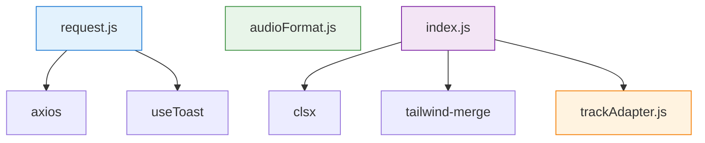

# 工具函数模块 (Utils)

> **导航：** [项目根目录](../../CLAUDE.md) > [src](../CLAUDE.md) > utils
>
> **最后更新：** 2026-02-07
> **文件数量：** 4 个
> **职责：** HTTP 请求封装、音频格式处理、音轨数据适配、样式工具函数

---

## 📋 模块概览

工具函数模块提供项目所需的通用工具和辅助函数，包括 HTTP 请求封装、音频格式检测与处理、音轨数据转换、样式类名合并等功能。

### 核心功能

- ✅ **HTTP 请求封装** - Axios 实例配置、请求/响应拦截、统一错误处理
- ✅ **音频格式处理** - 浏览器兼容性检测、音频源选择、时长/播放量格式化
- ✅ **音轨数据适配** - 统一不同数据源（音乐详情、视频解析）的数据格式
- ✅ **样式工具函数** - Tailwind CSS 类名合并

### 文件列表

| 文件 | 导出内容 | 职责 |
|------|----------|------|
| [request.js](#1-requestjs-http-请求封装) | `request` (default) | Axios 实例，统一请求/响应处理 |
| [audioFormat.js](#2-audioformatjs-音频格式处理) | 7 个函数 | 音频格式检测、最佳音源选择、格式化工具 |
| [trackAdapter.js](#3-trackadapterjs-音轨数据适配器) | 6 个函数 | 音轨数据转换、临时文件管理 |
| [index.js](#4-indexjs-统一导出) | `cn`, 音轨适配器函数 | 工具函数统一导出入口 |

---

## 1. request.js (HTTP 请求封装)

### 功能说明

封装 Axios 实例，提供统一的 HTTP 请求配置、请求/响应拦截、错误处理和用户提示。

### 配置信息

```javascript
{
  baseURL: '/api',           // 使用 Vite 代理
  timeout: 120000,           // 超时 120 秒（视频解析需要较长时间）
  headers: {
    'Content-Type': 'application/json;charset=UTF-8'
  }
}
```

### 请求拦截器

**功能：**
- 自动为 GET 请求添加时间戳参数 `_t`，防止缓存（可通过 `config.skipCacheTTL` 禁用）
- 预留 Token 认证接口（已注释）

**示例：**
```javascript
// GET /api/music/list?page=1&_t=1672531200000
```

### 响应拦截器

**功能：**
- 自动解析后端统一响应格式：`{ code: 200, message: '操作成功', data: ... }`
- 成功时返回 `data` 字段（直接返回业务数据）
- 失败时显示 Toast 提示并抛出错误

**HTTP 状态码处理：**
- `400` - 请求参数错误
- `401` - 未授权，请重新登录
- `403` - 拒绝访问
- `404` - 请求的资源不存在
- `500` - 服务器内部错误
- `timeout` - 请求超时
- `Network Error` - 网络错误

### 使用方式

```javascript
import request from '@/utils/request'

// 自动获取 data 字段
const musicList = await request.get('/music/list', { params: { page: 1 } })
console.log(musicList) // 直接是业务数据，不需要 .data
```

### 依赖

- `axios` - HTTP 客户端
- `@/composables/useToast` - Toast 提示

---

## 2. audioFormat.js (音频格式处理)

### 功能说明

提供音频格式检测、浏览器兼容性判断、最佳音频源选择、时长/播放量格式化等工具函数。

### 导出函数

#### 2.1 `getFormatMimeType(format)`

获取音频格式对应的 MIME 类型。

**参数：**
- `format: string` - 音频格式（如 `'mp3'`, `'ogg'`, `'wav'` 等）

**返回：**
- `string` - MIME 类型（如 `'audio/mpeg'`）

**支持格式：**
- `mp3` → `audio/mpeg`
- `ogg` → `audio/ogg`
- `wav` → `audio/wav`
- `flac` → `audio/flac`
- `m4a` → `audio/mp4`
- `aac` → `audio/aac`
- `webm` → `audio/webm`

**示例：**
```javascript
getFormatMimeType('mp3') // => 'audio/mpeg'
```

---

#### 2.2 `canPlayFormat(format)`

检测浏览器是否支持指定音频格式。

**参数：**
- `format: string` - 音频格式

**返回：**
- `boolean` - 是否支持

**实现原理：**
使用 `document.createElement('audio').canPlayType()` API 检测。

**示例：**
```javascript
canPlayFormat('mp3') // => true (大多数浏览器)
canPlayFormat('flac') // => false (部分浏览器不支持)
```

---

#### 2.3 `selectBestAudioSource(sources)`

从多个音频源中选择最佳音频源。

**选择策略：**
1. 过滤出浏览器支持的格式
2. 按音质优先级排序（high > medium/standard > low）
3. 返回最高音质的音频源

**参数：**
- `sources: Array<Object>` - 音频源数组
  - `format: string` - 音频格式
  - `quality: string` - 音质等级（`'high'` | `'medium'` | `'standard'` | `'low'`）
  - `url: string` - 音频 URL

**返回：**
- `Object | null` - 最佳音频源对象，如果没有可用源则返回 `null`

**降级策略：**
如果没有浏览器支持的格式，返回第一个音频源作为降级方案。

**示例：**
```javascript
const sources = [
  { format: 'mp3', quality: 'high', url: 'http://example.com/audio.mp3' },
  { format: 'ogg', quality: 'low', url: 'http://example.com/audio.ogg' }
]

selectBestAudioSource(sources)
// => { format: 'mp3', quality: 'high', url: 'http://example.com/audio.mp3' }
```

---

#### 2.4 `formatDuration(seconds)`

格式化时长（秒 → mm:ss）。

**参数：**
- `seconds: number` - 秒数

**返回：**
- `string` - 格式化后的时长（如 `'3:45'`, `'0:05'`）

**示例：**
```javascript
formatDuration(225) // => '3:45'
formatDuration(5)   // => '0:05'
formatDuration(0)   // => '0:00'
```

---

#### 2.5 `formatPlayCount(count)`

格式化播放量（万为单位）。

**参数：**
- `count: number` - 播放量

**返回：**
- `string` - 格式化后的播放量（如 `'1.5万'`, `'9999'`）

**规则：**
- `>= 10000` - 转换为"万"单位（保留 1 位小数）
- `< 10000` - 直接显示数字

**示例：**
```javascript
formatPlayCount(15000)  // => '1.5万'
formatPlayCount(9999)   // => '9999'
formatPlayCount(0)      // => '0'
```

---

## 3. trackAdapter.js (音轨数据适配器)

### 功能说明

统一不同数据源（音乐详情、视频解析）的数据格式，将其转换为播放器需要的标准音轨对象。

### 设计目标

- **统一数据格式** - 不同数据源转换为相同的音轨结构
- **保留元数据** - 使用 `_source`, `_platform` 等字段标识数据来源
- **临时文件管理** - 支持视频解析临时文件的过期时间管理

### 标准音轨对象结构

```javascript
{
  // 基础信息
  id: string,               // 音轨ID
  title: string,            // 标题
  coverUrl: string,         // 封面URL
  duration: number,         // 时长（秒）

  // 音频源
  audioSources: Array<{
    url: string,            // 音频URL
    format: string,         // 格式（mp3/m4a等）
    quality: string         // 音质（high/medium/low）
  }>,

  // 歌手/专辑信息
  artistNames: string,      // 歌手名（多个用 "/" 分隔）
  albumName: string,        // 专辑名
  artists: Array<Object>,   // 完整歌手对象数组

  // 其他信息
  fileUrl: string | null,   // 文件URL
  lyrics: string | null,    // 歌词
  playCount: number,        // 播放量
  favoriteCount: number,    // 收藏量
  releaseDate: string,      // 发布日期
  categoryName: string,     // 分类名
  tags: Array<string>,      // 标签

  // 元数据（私有字段，下划线开头）
  _source: string,          // 数据来源（'music_detail' | 'video_parse'）
  _isTemporary: boolean,    // 是否临时文件
  _platform?: string,       // 平台（video_parse 专用）
  _sourceVideoId?: string,  // 源视频ID（video_parse 专用）
  _expiresAt?: string       // 过期时间（video_parse 专用）
}
```

### 导出函数

#### 3.1 `adaptVideoToTrack(videoParseResult)`

将视频解析结果转换为音轨对象。

**参数：**
- `videoParseResult: Object` - 视频解析结果（来自 `/api/video/parse`）

**返回：**
- `Object` - 标准音轨对象

**特殊处理：**
- `id` - 生成临时 ID：`'video_' + sourceVideoId`
- `artistNames` - 默认为 `'视频音频'`（标识来源）
- `albumName` - 默认为 `'视频提取'`
- `tags` - 添加 `['视频音频']` 标签
- `_source` - 设为 `'video_parse'`
- `_isTemporary` - 设为 `true`
- `_expiresAt` - 保留过期时间

**示例：**
```javascript
const videoResult = {
  sourceVideoId: 'BV1xxx',
  platform: 'BILIBILI',
  title: '热门音乐MV',
  audioUrl: 'http://localhost:8910/audio/temp-xxx.mp3',
  audioFormat: 'mp3',
  coverUrl: 'http://...',
  duration: 240,
  expiresAt: '2026-02-07T01:00:00Z'
}

const track = adaptVideoToTrack(videoResult)
// => {
//   id: 'video_BV1xxx',
//   title: '热门音乐MV',
//   artistNames: '视频音频',
//   albumName: '视频提取',
//   audioSources: [{ url: '...', format: 'mp3', quality: 'high' }],
//   _source: 'video_parse',
//   _isTemporary: true,
//   _expiresAt: '2026-02-07T01:00:00Z',
//   ...
// }
```

---

#### 3.2 `adaptMusicToTrack(musicDetail)`

将音乐详情转换为音轨对象。

**参数：**
- `musicDetail: Object` - 音乐详情对象（来自 `/api/music/{id}`）

**返回：**
- `Object` - 标准音轨对象

**特殊处理：**
- `artistNames` - 从 `artists` 数组中提取角色为 `'singer'` 的歌手名，用 `"/"` 分隔
- `_source` - 设为 `'music_detail'`
- `_isTemporary` - 设为 `false`

**示例：**
```javascript
const musicDetail = {
  id: 123,
  title: '晴天',
  artists: [
    { name: '周杰伦', role: 'singer' },
    { name: '方文山', role: 'lyricist' }
  ],
  ...
}

const track = adaptMusicToTrack(musicDetail)
// => {
//   id: 123,
//   title: '晴天',
//   artistNames: '周杰伦',
//   _source: 'music_detail',
//   _isTemporary: false,
//   ...
// }
```

---

#### 3.3 `isTemporaryTrack(track)`

检查音轨是否为临时文件（视频解析）。

**参数：**
- `track: Object` - 音轨对象

**返回：**
- `boolean` - 是否为临时文件

**判断逻辑：**
```javascript
track._isTemporary === true || track._source === 'video_parse'
```

---

#### 3.4 `getExpiryHint(track)`

获取音轨的过期时间提示。

**参数：**
- `track: Object` - 音轨对象

**返回：**
- `string | null` - 过期时间提示文本（如 `'45 分钟后过期'`, `'1 小时后过期'`, `'音频已过期'`）

**规则：**
- 非临时文件或无过期时间 → 返回 `null`
- 已过期 → `'音频已过期'`
- 剩余时间 < 60 分钟 → `'N 分钟后过期'`
- 剩余时间 >= 60 分钟 → `'1 小时后过期'`

---

#### 3.5 `isTrackExpired(track)`

检查音轨是否已过期。

**参数：**
- `track: Object` - 音轨对象

**返回：**
- `boolean` - 是否已过期

**判断逻辑：**
- 非临时文件或无过期时间 → `false`
- 当前时间 >= 过期时间 → `true`

---

## 4. index.js (统一导出)

### 功能说明

工具函数模块的统一导出入口，提供样式类名合并工具和音轨适配器函数的重新导出。

### 导出内容

#### 4.1 `cn(...inputs)`

合并 Tailwind CSS 类名（使用 `clsx` + `tailwind-merge`）。

**参数：**
- `...inputs: any[]` - 类名输入（支持字符串、对象、数组）

**返回：**
- `string` - 合并后的类名

**功能：**
- 合并多个类名
- 处理条件类名
- 自动去重和覆盖 Tailwind CSS 冲突类名

**示例：**
```javascript
import { cn } from '@/utils'

// 基础用法
cn('px-2 py-1', 'bg-red-500')
// => 'px-2 py-1 bg-red-500'

// 条件类名
cn('px-2', { 'bg-red-500': true, 'text-white': false })
// => 'px-2 bg-red-500'

// Tailwind 冲突处理（后者覆盖前者）
cn('px-2', 'px-4')
// => 'px-4'
```

#### 4.2 音轨适配器函数重新导出

```javascript
export {
  adaptVideoToTrack,
  adaptMusicToTrack,
  isTemporaryTrack,
  getExpiryHint,
  isTrackExpired
} from './trackAdapter'
```

**使用方式：**
```javascript
import { adaptVideoToTrack, isTemporaryTrack } from '@/utils'
```

---

## 📦 依赖关系



### 外部依赖

- `axios` - HTTP 客户端
- `clsx` - 类名合并工具
- `tailwind-merge` - Tailwind CSS 类名去重

### 内部依赖

- `@/composables/useToast` - Toast 提示（request.js 使用）

---

## 🔧 使用示例

### 示例 1：HTTP 请求

```javascript
import request from '@/utils/request'

// GET 请求
const musicList = await request.get('/music/list', {
  params: { page: 1, pageSize: 10 }
})

// POST 请求
const result = await request.post('/video/parse', {
  videoUrl: 'https://www.bilibili.com/video/BV1xxx'
})
```

### 示例 2：音频格式检测与选择

```javascript
import { canPlayFormat, selectBestAudioSource } from '@/utils/audioFormat'

// 检测浏览器支持
if (canPlayFormat('flac')) {
  console.log('支持 FLAC 格式')
}

// 选择最佳音频源
const sources = [
  { format: 'flac', quality: 'high', url: '...' },
  { format: 'mp3', quality: 'medium', url: '...' }
]
const bestSource = selectBestAudioSource(sources)
```

### 示例 3：音轨数据转换

```javascript
import { adaptVideoToTrack, isTemporaryTrack, getExpiryHint } from '@/utils'

// 转换视频解析结果
const videoResult = await parseVideo('https://...')
const track = adaptVideoToTrack(videoResult)

// 检查是否临时文件
if (isTemporaryTrack(track)) {
  console.log('这是临时文件')
  console.log(getExpiryHint(track)) // => '45 分钟后过期'
}
```

### 示例 4：样式类名合并

```vue
<script setup>
import { cn } from '@/utils'

const isActive = ref(true)
</script>

<template>
  <button
    :class="cn(
      'px-4 py-2 rounded',
      { 'bg-blue-500 text-white': isActive },
      'hover:bg-blue-600'
    )"
  >
    按钮
  </button>
</template>
```

---

## ⚠️ 注意事项

### 1. 请求超时配置

视频解析功能需要较长时间，`request.js` 的超时时间已配置为 **120 秒**。如果后端处理时间更长，需要调整：

```javascript
// src/utils/request.js
timeout: 180000 // 调整为 180 秒
```

### 2. 音频格式兼容性

不同浏览器对音频格式的支持程度不同：

| 格式 | Chrome | Firefox | Safari | Edge |
|------|--------|---------|--------|------|
| MP3 | ✅ | ✅ | ✅ | ✅ |
| OGG | ✅ | ✅ | ❌ | ❌ |
| FLAC | ✅ | ✅ | ✅ | ✅ |
| M4A | ✅ | ❌ | ✅ | ✅ |

**建议：** 使用 `selectBestAudioSource()` 自动选择浏览器支持的最佳格式。

### 3. 临时文件过期处理

视频解析的音频文件有 **1 小时有效期**：

```javascript
import { isTrackExpired } from '@/utils'

// 播放前检查
if (isTrackExpired(track)) {
  console.error('音频已过期，需要重新解析')
  // 提示用户重新解析视频
}
```

### 4. 响应拦截器限制

`request.js` 的响应拦截器假定后端返回格式为：

```json
{
  "code": 200,
  "message": "操作成功",
  "data": { ... }
}
```

如果后端格式不同，需要修改响应拦截器逻辑。

---

## 🧪 测试建议

### 单元测试清单

- [ ] `request.js` - 测试请求/响应拦截器、错误处理
- [ ] `audioFormat.js` - 测试格式检测、音频源选择、格式化函数
- [ ] `trackAdapter.js` - 测试数据转换、临时文件管理、过期时间计算
- [ ] `index.js` - 测试 `cn()` 函数的类名合并逻辑

### 测试覆盖率目标

**建议覆盖率 > 80%**，重点测试：
- 错误边界处理（空值、无效数据）
- 浏览器兼容性检测
- 时间计算逻辑（过期时间）

---

## 📝 待办事项

- [ ] 添加单元测试（覆盖率 > 80%）
- [ ] 为 `request.js` 添加请求重试机制（可选）
- [ ] 为 `audioFormat.js` 添加更多音频格式支持（如 AAC、OPUS）
- [ ] 为 `trackAdapter.js` 添加数据校验功能
- [ ] 添加 TypeScript 类型定义

---

## 🔗 相关文档

| 文档 | 说明 |
|------|------|
| [项目根文档](../../CLAUDE.md) | 项目完整架构和模块索引 |
| [API 模块](../api/CLAUDE.md) | API 接口层文档 |
| [Composables 模块](../composables/CLAUDE.md) | 可组合函数文档 |
| [Stores 模块](../stores/CLAUDE.md) | 状态管理文档 |

---

**最后更新：** 2026-02-07 00:05:33
**文档版本：** 1.0.0
**维护者：** AI 自动生成
